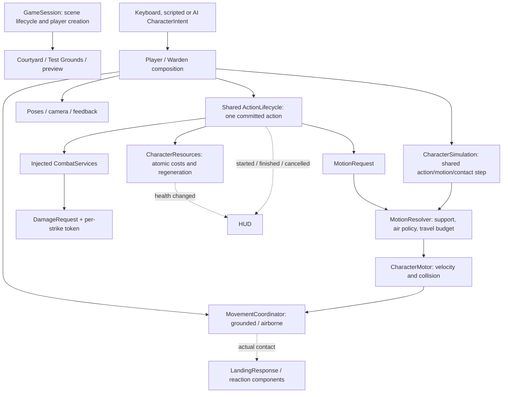

# Character systems — implemented architecture

The [development contracts and build workflow](docs/DEVELOPMENT.md) describe shared
slope placement, explicit action transitions, atomic death notifications, cancellation
callback rules, menu input ownership, and clean release validation.

Implemented on 20 September 2026 with Godot **4.6.2 stable, 71f334935**, typed
GDScript and Compatibility rendering. This milestone restructures the existing
prototype. The subsequent movement/contact refinements are included below.
The current motion extraction is explained in [MOTION_PIPELINE.md](docs/MOTION_PIPELINE.md).
Procedural generation, streaming, gameplay saves, structural collapse,
equipment progression and additional movement modes remain future work. The
[item foundation](docs/ITEM_SYSTEM.md) now supplies inventory, gameplay loadouts,
authored upgrades and record conversion for the existing sword, spells and flask.

## Separate Soulbound HUD visual prototype

[art_source/ui/soulbound_hud](art_source/ui/soulbound_hud/README.md) contains the
editable browser preview, transparent stone art, offline exporter and tests.
Its pure `SoulController` owns preview resource accounting and phase timing.
The separate [ManaEvolution model](art_source/ui/soulbound_hud/src/mana-evolution.js)
resolves permanent reserve-based progression and temporary full-mana effects;
its [renderer](art_source/ui/soulbound_hud/src/mana-evolution-renderer.js) only
observes state and draws ornaments. Acquiring storage preserves absolute Soul;
the Canvas presentation reads actual and animated values separately. Both
gameplay-size and close-up views share that state. No Godot character or UI
component depends on this preview; `.gdignore` excludes it from asset imports.
See its [progress and integration boundary](art_source/ui/soulbound_hud/docs/DEVELOPMENT_PROGRESS.md).
The proposed [dark stone aura](art_source/ui/soulbound_hud/docs/DARK_SOUL_VFX_PLAN.md)
is distinct from the implemented browser refill effects and
[full-mana evolution aura](art_source/ui/soulbound_hud/docs/MANA_EVOLUTION.md).

## How the character is assembled

`features/character/player.tscn` is the canonical playable character.
`scenes/player.tscn` inherits it, preserving existing scene references. The
courtyard, laboratory and motion preview instantiate that same scene.

The components are focused `RefCounted` objects owned by the character, plus
scene nodes for cameras and world effects. A component does not need to be a
Node unless it uses the scene tree. Dependencies are passed by `configure()` or
assigned before entering the tree. This follows [Godot's scene organization
and dependency-injection guidance](https://docs.godotengine.org/en/4.6/tutorials/best_practices/scene_organization.html).

## Ownership and feature locations

| Owner | Implementation | Responsibility |
| --- | --- | --- |
| GameSession autoload | `features/session/game_session.gd` | Active world, player factory, pause, retry, scene changes |
| Character composition | `features/character/player.gd` | Wires components, orders each physics tick, exposes compatibility API |
| Input / AI | `features/character/input_controller.gd`, `warden_controller.gd` | Keyboard, scripted or Warden decisions produce intent; gameplay uses one request interface |
| Shared simulation | `features/character/character_simulation.gd` | Advances actions, resolves requests, moves once and dispatches post-contact phases |
| Motion resolver | `features/character/motion_resolver.gd` | Ground/air arbitration and retained departure velocity per character |
| Motion budget | `features/character/motion_budget.gd` | Action-owned requested travel; ground cap, no air stop on exhaustion |
| Motor | `features/character/character_motor.gd` | Horizontal requests, acceleration, turning, gravity, capsule collision, step-up, launch and teleport |
| Movement coordinator | `features/character/movement_coordinator.gd` | Current grounded/airborne mode and transition signal |
| Resources | `features/character/character_resources.gd` | Per-instance health, stamina, mana, flasks, delays and atomic spending |
| Items | `features/items/` | Shared catalog; per-character inventory, hand/quick-slot loadout, upgrades, accepted item snapshots and atomic item costs; player flask access delegates to inventory |
| Action lifecycle | `features/abilities/action_lifecycle.gd` | Shared queued requests, validation, atomic costs, buffer, ownership, mode-exit policy and result signals |
| Action execution | `features/abilities/ability_controller.gd`, `warden_actions.gd` | Player actions / Warden patterns extend the same lifecycle; use the captured definition |
| Forward dive | `features/abilities/forward_dive.gd` | Preparation, air and ground phases for the shared forward/stationary dodge |
| Ground roll | `features/abilities/ground_roll.gd` | Side/back timing and requested horizontal travel; no upward launch |
| Targeting | `features/combat/character_targeting.gd` | Selected target and camera lock; player composes target-facing or running-facing intent |
| Combat context | `features/combat/combat_services.gd` | Target queries, melee, spell creation, faction masks and line of sight |
| Damage receiver | `scripts/combatant.gd` | Shared body setup, resources, damage and health/death signals |
| Fitted sensing | `features/combat/character_hitboxes.gd`, `damage_queries.gd` | Animated body regions, nonblocking hit confirmation and world-scoped candidates |
| Head immersion | `features/swimming/head_water_detector.gd` | Mouth/nose marker, surface hysteresis and wet/dry time intervals |
| Visuals | `features/presentation/` | Character poses, forward-dive sampler, locomotion corrections, shoulder camera, visual/audio effects |
| Warden composition | `scripts/boss.gd` | Wires controller, lifecycle, motor, resources, movement and `warden_presentation.gd`; original three patterns retained |
| World scene hosts | `scripts/arena.gd`, `scripts/movement_lab.gd` | Environment construction, encounter/station policy and HUD wiring |

`CharacterMotor` is the only production character code calling
`move_and_slide()` or applying physical displacement. Abilities request motion;
poses never move the collision body. Projectiles have their own swept-ray
movement. The camera follows the body and does not dictate locomotion facing.

Legacy scripts such as `scripts/player.gd`, `scripts/shoulder_camera.gd`,
`scripts/knight_locomotion.gd` are small
compatibility adapters. `CombatTuning` exposes read-only legacy field names over
focused definitions. These paths avoid breaking existing scenes, tools and
regressions while feature code moves incrementally. Existing UI and environment
scripts are retained; this is not a wholesale rename of every prototype file.

## Contracts

| Contract | Meaning |
| --- | --- |
| `CharacterIntent` | World-space movement and optional facing/aim, sprint request and one requested action |
| `AbilityDefinition` | Stable ID, cost tuple, timings, supported modes, mode-exit and airborne-motion policies, required capabilities, damage interruption, delivery properties and variant |
| `MotionRequest` | Transient horizontal motion, inherit/retain/directed air policy, gravity multiplier, optional travel budget and explicit braking |
| `ActionResult` | `resolved`, `accepted`, `reason`, plus a one-shot `completed(result)` signal; queued is not accepted |
| `AimRequest` | Explicit world-space origin and aim point; spell delivery does not inspect cameras or player controls |
| `DamageRequest` | Source (possibly gone), strike ID/token, damage type, amount and impact position |
| `PersistentEntityState` | Stable entity ID, definition ID, state version and a copied dictionary of changes; serialization boundary only |

Both characters expose `submit_intent(intent)`, `request_action(action_id)` and
`get_aim()`. Requests reserve the single pending slot; only the next physics tick
can accept them, after ongoing costs. Inspect `result.resolved` first: an immediate
rejection already has a reason, while a queued result emits `completed` later.
`accepted` means the action actually started and paid its cost, not merely queued.
`begin()` is a legacy **queue** helper whose true return means queued only.

Keyboard/intent requests may buffer briefly during commitment. Direct requests
reject commitment immediately. A newer queued request resolves the old one as
`superseded`; expiration, reset, death and unload also resolve pending results.
Tests await the actual character tick rather than bypassing the ordering rule.
See [ADR 004](docs/decisions/004-action-lifecycle.md) for caller examples.

The Warden controller still chooses the original three attacks. It can use the
same spell lifecycle and explicit aim when driven by tests or another controller;
normal encounter AI has not gained spells.

Signals report outcomes: health changes, damage, death, movement mode changes,
and action start/finish/cancellation. Direct calls request behavior. The HUD
continues to observe health/resource signals rather than owning combat state.

## Definition data versus live state

Edit shared `.tres` definitions under:

- `features/character/data/`: physical movement and resource/regeneration settings.
- `features/abilities/data/`: light/heavy, bolt/burst (including projectile properties),
  healing, forward dive, grounded side/back roll and the three `boss_*.tres` patterns.
- `features/combat/data/`: combat defaults and references to boss definitions.
- `features/items/data/`: item catalog, starter loadout, movesets, supply/equipment/presentation profiles and authored upgrade levels.
- `data/locomotion.tres`: presentation profile, now using
  `features/presentation/locomotion_definition.gd`.

Definitions are read-only **by runtime convention**; Godot does not make Resource
properties immutable. Do not store timers, victims, current resources or active
pose state in them. Each actor owns those values. When making a private editable
variant in code, explicitly duplicate each definition that will be edited and
verify its nested references. Do not assume copying the outer tuning object
isolates resources assigned through script defaults. Prefer authored `.tres`
profiles, as the optional movement-practice target does.
Imported idle/walk clips are copied before instance-specific loop flags are set.

Dodge selection belongs to the shared ability controller. Forward movement or no
movement selects `dodge_forward`; side/back movement selects `dodge_ground`,
relative to body facing at acceptance. Courtyard, Test Grounds and preview use
these same definitions. World setup cannot select a legacy movement profile;
the old hop definition, executor, aliases and comparison menu have been removed.

An action captures its definition when it begins. Costs, timing and presentation
use that captured definition through completion. Executors hold per-character
clocks and request velocity; only the motor moves the collision body. Presentation
samples the resulting state. [Decision 005](docs/decisions/005-shared-dodge.md)
records the removal and review boundary.

The subsequent adaptive-clearance refinement keeps this ownership boundary:
the motor performs read-only support, surface, capsule and headroom queries;
the forward-dive action chooses and owns its launch height once, while grounded.
The shared dodge definition contains only the switch, rise limit, margin and
sampling settings. Only the motor applies the launch velocity. The presentation
uses the selected flight duration, while actual floor contact triggers rolling.
The reusable laboratory fixture is shared by tests and native review scenes.

## Physics tick and lifecycle

1. Restore the previous authoritative pose, then advance action/buffer clocks
   and validate the camera target. Render interpolation cannot seed transitions.
2. Regenerate resources according to current action and delays.
3. Sample intent and pay ongoing sprint exertion **before** new action requests.
4. Check action compatibility, capabilities and the entire cost tuple. Rejecting
   any part spends nothing. Only then acquire action ownership.
5. Both player and Warden call `CharacterSimulation.step()`. It advances the
   action and resolves its typed request against locomotion, support and budget.
6. Motor integrates gravity and collision once. The resolver captures departure
   velocity after collision; the coordinator reports actual floor/mode changes.
   Landing listeners may replace or cancel action ownership.
7. Shared post-motion dispatch resolves action phase/pose clocks. A replacement
   receives none of its predecessor's elapsed motion time. Finish idle actions
   and emit diagnostics/HUD updates. Input/resources/presentation policies remain
   in the character compositions.
8. The pose driver evaluates controlled land animation once and captures specialized
   water/dive/reaction results without double advancement. The player publishes
   world-space fitted sensing geometry, accounts for head immersion and emits
   `simulation_stepped`. Combat reads the previous completed physics frame;
   breathing reads the current owner pose. Rendering displays saved poses only.
   See [animation ownership and scaling](docs/ANIMATION_SYSTEM.md).

Grounded/airborne locomotion, ledge attachment, and surface/underwater swimming
are implemented. Movement mode and committed action remain separate values.
Swimming adds ongoing exertion at this ordering boundary; full free climbing and
flight/mana-exhaustion behavior remain deferred.

Cancellation clears the pending buffer, damage-window token, immunity and any
forward-dive pose ownership. Death overrides ordinary interruption rules. Reset
restores resources and camera follow. Exiting the tree cancels the active action.
World context cleanup removes its projectiles and transient feedback. A released
projectile can finish safely if only its caster unloads; it does not keep that
caster alive. The world owns projectile lifetime after release.

Each strike owns a `StrikeToken` containing the victims it has hit. The token is
released at action/projectile completion, so receivers do not accumulate combat
history forever. Legacy string-only damage calls use an adapter capped at 128
entries with an eight-second simulation-time expiry. New combat uses tokens.

## Environment independence

World hosts explicitly provide `CombatServices`. A character instantiated by
itself creates a local default context without requiring parent methods. Bolts
receive an explicit world-space aim request. `player_aim.gd` converts the player's
selected target or reticle into that request; AI supplies its own. Bursts query compatible
receivers and check walls. Neither depends on an arena node or a variable named
`boss`. Context and projectile scenes are runtime-loaded at the dependency
boundary to avoid a cyclic script preload discovered during teardown tests.

The preview only supplies a stage, camera and playback UI. It has no second
physics integrator. Frame step runs one real physics tick; quarter speed uses
Godot's time scale and restores it on scene exit. The separate camera/keybinding
settings files and menus are retained.

## Extending one mechanic

Agree on controls, animation references, transition rules and acceptance checks
first. Add the smallest mode/ability plus its focused definition. Implement
physical movement through the motor and visual response through presentation.
Exercise it in the lab with collision, interruption, reset and optional combat
targets, then review its feel before enabling another mechanic. Do not add future
systems merely because a contract or fixture exists.

See [DEVELOPMENT_ROADMAP.md](DEVELOPMENT_ROADMAP.md),
[decision records](docs/decisions/001-character-composition.md) and the
[Milestone 1 review](docs/FOUNDATION_REVIEW.md).

## Movement 02: contact-driven jumping and physical reactions

The motor now distinguishes ground steering from weak airborne steering, captures
pre-collision impact speed and owns an explicit controlled/ragdoll handover.
MovementCoordinator tracks single-use edge grace and actual landing transitions.
Jump spends atomically through the shared lifecycle and releases its action slot
after takeoff. LandingResponse consumes contact, asks the action owner for heavy
recovery and sends environmental damage through the shared receiver.

ReactionController responds to accepted descending hits and lethal landings. It
asks the ability controller to acquire the reaction slot, and the motor to suspend
capsule integration. RagdollDriver owns a ten-body physical rig assembled from
shared `ragdoll_part.gd` Resources in `knight_ragdoll.tres`. Physical bones move
under Godot physics; only the motor updates the logical CharacterBody3D anchor.
Bones explicitly delegate damage to their character, so projectiles and melee
retain the normal receiver, faction and strike-deduplication paths.

After settling, the motor validates floor and standing clearance. Physical-bone
collision stops before restoring the capsule. ReactionController selects face-up
or face-down recovery and a heading from the settled torso. GetUpPresentation
blends the captured physical pose into Resource-authored hand-plant/kneel/rise
poses, using LimbIK to retain contacts against the support plane supplied by the
motor. The reaction owns the 1.20-second clock and retains the action even after
a nonlethal hit; health damage still applies. No animation code moves the collision
body. See [supported recovery](docs/GET_UP_RECOVERY.md) for files and tuning. The rig is created during scene readiness, so an
instantiated character freed before entering the tree cannot leak orphan Nodes.

Worlds own death UI/reset delays; the reaction has no courtyard/lab references.
Reset/unload stops all physics and restores collision and presentation. Existing
input settings migrate without discarding old bindings. Rig setup is separate
from reaction policy; a different skeleton supplies its own part definitions.

See [Movement 02](docs/MOVEMENT_02_JUMP_FALL_LAND.md),
[decision 006](docs/decisions/006-jump-contact-lifecycle.md) and
[decision 007](docs/decisions/007-ragdoll-handover.md).

## Contact skill and failed-dive reaction

Descending Dodge uses the shared one-slot input buffer with a 0.15 s window.
LandingResponse classifies the full impact before requesting a paid contact roll;
ActionLifecycle resolves its cost and replacement through the common atomic path.
A successful grounded forward roll replaces heavy recovery and halves eligible
fall damage. Lethal heights are excluded before mitigation.

ReactionController handles missed heavy cliff-dive checks by taking physical
ownership. Presentation preserves the current diving pose across cancellation;
the physical rig does not report the same controlled impact again. Survivors use
the existing settle/clearance/get-up path. Walking/jumping failures keep their
normal heavy landing. Motor collision and world hosts remain unchanged.

The new focused Resource is `features/abilities/data/landing_roll.tres`.
See [behavior and ownership](docs/CLIFF_DIVE_LANDING.md) and
[decision 008](docs/decisions/008-contact-roll-and-dive-failure.md).

Directional ground rolls now declare `RETAIN_DEPARTURE`, while the forward dive
declares `DIRECTED`. The shared resolver owns airborne velocity selection and the
shared budget owns distance accounting; neither executor independently implements
the air-distance cutoff. Ground braking/playback clocks still pause while the
action-wide clock expires immunity normally. The Warden also runs through this
simulation, and losing a target now cancels its action without stopping gravity.

Action release preserves actual collision-resolved momentum. Reset/teleport and
physical ragdoll handover clear temporary resolver state. The new
`run_motion_contract` and `run_motion_boss` suites cover a minimal NPC composition,
the production Warden, multiple instances, action release, walls and cleanup.
The knight's existing landing/ragdoll components remain a separate composition
choice for other characters. See [the actual file tree, tick walkthrough and
extension rules](docs/MOTION_PIPELINE.md) and
[decision 009](docs/decisions/009-shared-motion-contract.md).

## Ledge support and constrained movement

The approved ledge extension separates persistent attachment from a committed
action: **Airborne + Jump → Climbing + Grab → Climbing + Free (hang) → Climbing +
Mantle → Grounded + Free**. MovementCoordinator owns the attachment/token; the
shared lifecycle owns grab/pull-up requests, cancellation and the atomic 10-stamina
payment. LedgeProbe only queries geometry. LedgeTraversal manages entry/release;
MantleAction emits constrained targets.

CharacterSimulation selects one motor path per tick. CharacterMotor owns posture
and collision sweeps; MotorStepResult supplies actual support rather than stale
floor flags. Presentation reads state and constrains limbs without moving the body.
ResourceRegenerationPolicy is shared by player and boss and requires grounded
support plus existing action/reaction eligibility. Hanging/airborne regen is off.

For the implemented file tree, interaction diagram, equations, tuning and validation,
see [the ledge review](docs/LEDGE_GRAB_PLAN.md) and
[ADR 010](docs/decisions/010-ledge-attachment-and-regeneration.md).

## Hanging locomotion and corner results

SurfaceAttachment now carries an optional constrained locomotion request and a
post-motion notification. A committed action takes priority. CharacterSimulation
still chooses a single motor path; LedgeShimmy commits a new grip only after that
step succeeds. Persistent support survives releasing movement input, and revoke
clears the request/token on detach, reset or unload.

Read-only EdgeProbe and CornerPath components find and validate geometry. Runtime
speed and progress live in LedgeShimmy. Per-hand face normals drive presentation
contacts while the body turns; animation never drives collision. See
[sideways movement, equations and file ownership](docs/LEDGE_SHIMMY.md).

## Shared menu and diagnostics (22 September 2026)

Both HUDs compose `features/ui/pause_menu.tscn` with explicit character and
optional laboratory dependencies. The shell owns page history, focus, draft-loss
prompts and pause requests through GameSession. `lab_tools.gd` calls existing
lab commands; it does not teleport or change the character itself.

`settings_panel.tscn` composes Camera, Controls and Display editors on the
`settings_page.gd` base. Editors own temporary drafts; Apply publishes through
the existing preferences/input services. Reset changes the draft only.
`ui_style.gd` supplies one cached theme, separate from 3D rendering effects.

`character_diagnostics.gd` reads component state and subscribes to action/mode
result signals. It never probes geometry or advances gameplay. History is capped
at 40 events. `debug_geometry.gd` renders existing capsule/contact data without
collision. The full inspector snapshots state while paused; the compact live
overlay refreshes at 10 Hz only when visible, using a compact formatter rather
than building inspector tabs. Hidden live text and unchecked/hidden contact or
capsule visuals disable their frame callbacks; visibility and option changes
resume them. The old duplicate lab visualizer has been removed. Bounded event
history remains signal-driven so later inspection retains recent events. Both
debug interfaces are hidden by default. Ledge routes reuse one ImmediateMesh
and rebuild only when local path vertices change, including parent-transform
changes. Settings-tab and Controls-category navigation are saved immediately
in separate UI preference files; neither changes gameplay settings drafts.

Focused integration checks: `tests/run_menu.gd`. Menu state belongs to each world
instance; saved camera, controls and display preferences persist across scenes.

## Persistent crouching posture

`CharacterPosture` owns stance and lowering time independently of movement mode
and the committed action. `CharacterMotor.set_posture` supports an explicit
persistent shape, so crouch does not trigger the temporary-tuck auto-stand path.
Ability Resources declare `requires_standing`; the lifecycle validates costs and
requirements, then calls `prepare_start` before atomic payment. The player ability
controller uses that hook for stance changes, with no level dependencies.
`CrouchPresentation` selects legacy baked poses or profile-declared native UAL
clips and owns camera lowering; it never edits collision. Its final pelvis/leg IK
adaptation fits the visible body to the 0.96 m feet-anchored capsule. The motor
checks full roof clearance during step-up; 1.00 m passages with up to 2 cm local
variation remain traversable without dropping contact margins. See
[Movement 03](docs/MOVEMENT_03_CROUCH.md) for behavior and review.

## UAL appearance boundary

The UAL and legacy Knight adapters share a presentation base; neither model's
asset setup is inherited by the other. Editable rig/animation profiles separate
bone roles, native source clips and temporary action fallbacks. Appearance owns
body regions and armor on one skeleton. Equipment presentation owns carried-item
instances, sockets and desired layouts; an action bridge observes hand-release,
death and reset events without changing gameplay. Traversal requests a temporary
hand release instead of finding the UAL sword by child order.

The player's default visual is `scenes/models/ual_player.tscn`, an inherited UAL
mannequin scene with a sword-only loadout. The factory still accepts a visual scene
override for the full equipment review laboratory. The Warden retains its legacy
Knight presentation.

`sword_attack_presentation.gd` samples the shared native UAL2 light-attack clips
from the committed action clock. Profile attack definitions map authored strike
landmarks to gameplay windup, active and recovery phases; damage and movement stay
owned by gameplay. Airborne strikes preserve the lower-body flight pose, while
the equipped sword follows its hand socket. The same driver samples UAL1 heavy
attacks. `spell_presentation.gd` maps enter/idle/shoot/exit to the existing tap-cast
clock; `native_mantle_presentation.gd` consumes authored root translation and adapts
the pull-up pose to the accepted motor path while preserving native leg motion.
The profile's `mantle_source_end_seconds` selects the final climbing pose; the
remaining action blends into idle while the motor keeps its accepted timing.
Terrain foot placement is restricted to grounded walking/running clips, including
crouch-walk; idle, actions, death and ragdoll handoff clear the previous foot locks.
Walking targets shorten overextended strides where ground probes confirm support,
with gradual contact changes and a small capped pelvis adjustment to retain the
authored body height.
Mantle retains hand contacts without a separate knee/ankle placement pass. Actual
equipment placement chooses sword idle. Unconverted actions remain explicitly
labeled temporary adapters.
See [native actions](docs/UAL_ACTIONS.md), [sword integration](docs/UAL_SWORD_ATTACKS.md), the current
[UAL foundation contract](docs/UAL_FOUNDATION.md) and
[Blender artist workflow](docs/BLENDER_CHARACTER_WORKFLOW.md).

## Crawling movement extension

The player also composes a persistent crawling stance in `features/crawling/`.
Timed input requests use the shared action lifecycle; the motor owns its checked
prone capsule, and the physics pose driver samples the approved Mixamo retarget
before hitboxes and head immersion. See [crawling contracts and acceptance](docs/CRAWLING.md).

## Swimming movement extension

The shared player now composes water detection, surface/underwater movement, breath
and safe ledge exits. `CharacterSimulation` accepts a full 3D water motion request;
`CharacterMotor` remains the only collision-body mover. Water entry is resolved
before landing notifications, and the existing action lifecycle cancels incompatible
actions. Resources own breath; presentation owns UAL playback and camera tint.
See [swimming ownership and behavior](docs/SWIMMING.md).

The approved full-body sensing pass adds editable UAL and legacy Knight profiles,
precise projectile/melee/area confirmation, and head-bone breath detection. Sensing
remains nonblocking; motor collision and damage/strike ownership stay separate.
See [fitted hitboxes and head immersion](docs/HITBOXES.md).
