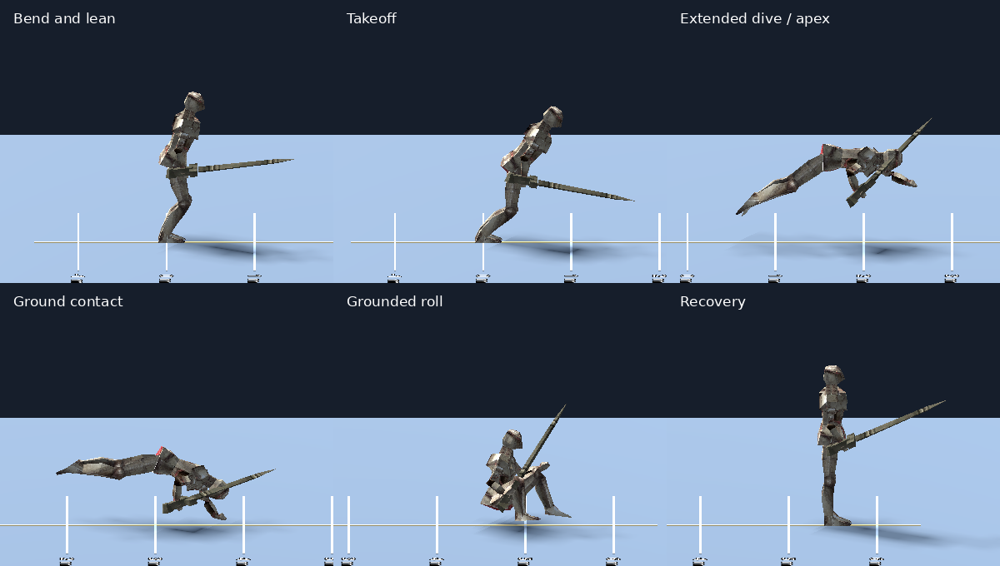

# Forward dodge — shared-character review

Both knees bend forward throughout supported preparation. The forward dive now
adapts its physical launch near suitable low obstacles and raised landings across
small gaps. See [the implementation and native crossing](docs/DIVE_CLEARANCE_PLAN.md).
The footage below has been refreshed with the knee correction; open-ground rise
remains 0.25 m.

The forward dive is shared by the **courtyard, Test Grounds and preview** through
the same character and ability. The old hop and comparison switch are removed.
Side/back use the referenced grounded rolls in both worlds;
see [0.70-second ground-roll review](docs/GROUND_ROLLS.md).

## Run and inspect

Restart the game and choose **Esc → Character Test Grounds**, or stay in the
courtyard. Press Dodge (default Space) from standing or while moving forward for
the adaptive dive. Side/back directions play their reference clips directly on
the ground over 0.70 s. These controls and definitions are identical in every host.

For close inspection, open `scenes/dodge_preview.tscn` and press **F6**:

- R: replay from a reset character.
- Space: pause/resume body and pose together.
- Right arrow: one actual physics tick (1/60 s at default settings).
- Speed menu: normal/quarter speed; scene exit restores the previous time scale.

F5 continues to launch the courtyard.

For the raised-gap example, open **`scenes/dive_clearance_preview.tscn` → F6**.
It reuses the same character, playback controls and measured lab fixture:
0.60 m start deck, 0.60 m gap, 1.00 m landing deck. The preview contains no
separate jump simulation. Both gap widths are playable in **02 Jumping**.

## Preserved working-tree tuning

| Setting | Shared forward dive |
| --- | --- |
| Preparation | 0.10 s |
| Rise on flat ground | 0.25 m |
| Adaptive clearance | Up to 0.60 m obstacle rise, with 0.12 m margin |
| Extension blend | 0.05 s |
| Initial air speed | 11 m/s |
| Travel budget | 5.5 m |
| Grounded finish | 0.55 s |
| Stamina | 25 |
| Immunity | 0.06–0.32 s from takeoff |

The working tree already contained the faster 0.10/0.05-second timings when the
architecture milestone began. Older documentation and preview assertions still
specified 0.24/0.10 seconds. The refactor preserves the actual current tuning.

Edit `features/abilities/data/dodge_forward.tres` for the forward dive and
`dodge_ground.tres` for side/back rolls. The shared action controller selects by
body-relative direction, and captures the definition when the action starts.
Worlds do not choose different movement profiles.
Forward clearance uses a 2.6 m lookahead and 0.1 m surface-probe spacing. Launch
height is action-instance state; shared definitions never store detected heights.

## Shared implementation

`features/character/player.tscn` composes the real motor, action/resource owners
and presentation. `features/abilities/forward_dive.gd` controls preparation,
flight and grounded recovery. `features/presentation/forward_dive_pose.gd` samples
the existing knight and Quaternius roll without editing the source assets.

The preview supplies only the flat stage, fixed camera and review UI. It no
longer uses separate collision displacement, fixed substeps or a duplicate action
clock. The displayed phase/time comes from the playable character. Ground contact,
ceiling obstruction, interrupted preparation, edge departures and landing behavior
are therefore shared with the lab.
The raised-gap scene supplies the reusable two-platform fixture instead of the
flat floor, using that same preview script and player.

The knight bends and leans into the dive with supporting feet planted; forward
acceleration begins in the latter half of preparation. Takeoff captures that pose
before extension. The source roll enters at clip position 0.24; transition poses
are adjusted against sampled armor clearance. The final grounded animation
pauses if support is lost. Preparation has no immunity and landing does not renew it.

## Measured results — 20 September 2026

The shared preview passes **37 checks**, and lab forward-dive integration passes
**44**. At 30/60/120 Hz, the apex measures approximately 0.250 m, travel 5.500 m,
and recovery uses 0.55 seconds of grounded playback within one physics tick.
Minimum sampled body armor clearance is approximately 0.024 m; this does not
prove weapon clearance against arbitrary scenery.

Native 60 Hz capture of the actual actor: landing at **0.3833 s**, completion at
**0.9333 s**, distance **5.5000 m**. Total time includes discrete preparation and
landing ticks. This replaces measurements from the retired preview integrator.

Native raised-gap capture at 60 Hz: landing **0.4167 s**, completion **0.9667 s**,
travel **5.2413 m**. Physical contact with the platform lip consumes some requested
travel; it is never saved for an extra push later. Full regression: **828 checks
across 18 suites pass**, including the new 81-check clearance suite.

The original baseline preview suite had six failures against the already-faster
tuning. It was replaced with shared-character collision/ownership/playback checks;
old slow-timing pose-continuity bounds are not presented as passing. Visual weight,
contact and recovery still need the user's review. No new dodge feel was approved
or introduced by the architecture work.

Run all regressions with `python3 tools/run_tests.py`. Capture native 60 Hz frames
with `tests/render_dodge_preview.gd`, then run
`python3 tools/export_dodge_preview.py` (Pillow required only for GIF export).
Frames and per-frame metadata go to `/tmp/dodge-preview-frames`. Sheet labels are
selected from actual phases rather than hardcoded assumptions about timing.

To reproduce the raised-gap footage, pass `-- --raised-gap` to the same Godot
capture script, then run `python3 tools/export_dive_clearance.py`. Frames go to
`/tmp/dive-clearance-frames`; GIFs, sequence sheet and measurements go to
`docs/dive-clearance/`.

Both worlds now use this forward dive and the same grounded side/back rolls.
Ask the user before any further development or movement tuning.
