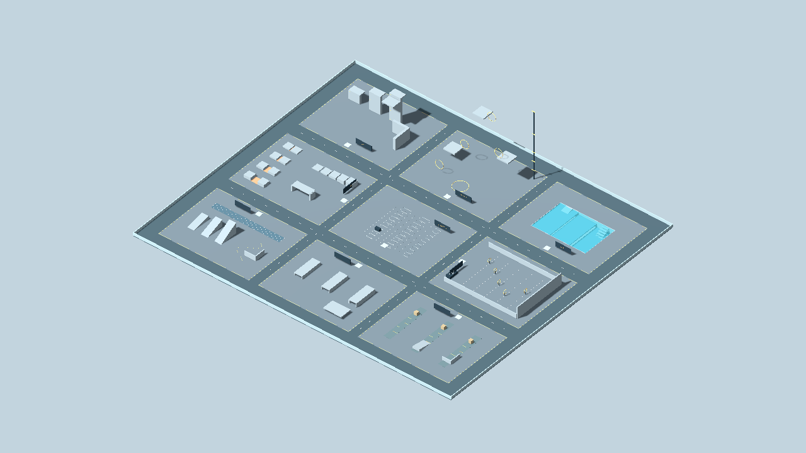
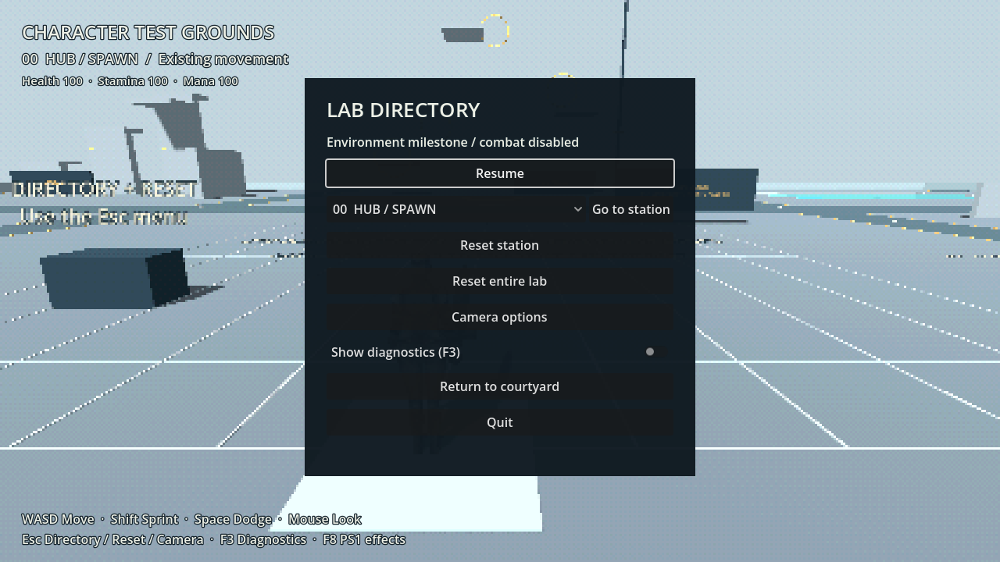
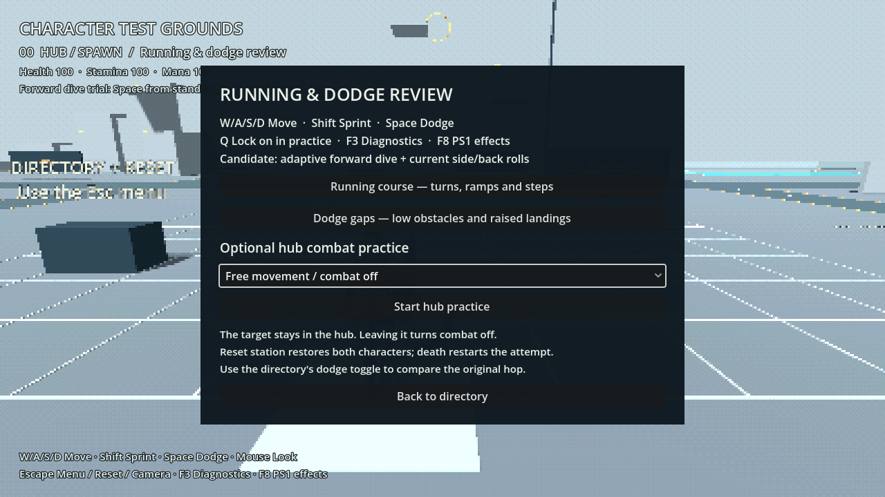

# Character Test Grounds

**Corner tests:** use **Esc → Test Grounds → Corner tests** for the outside corner, inside L,
and excluded segment in station 04. Jump and hang, then hold Left/Right to move
along the edge. [Behavior and current validation](docs/LEDGE_SHIMMY.md).

**Ledge review:** open **Esc → Test Grounds → Ledge tests** for station 04’s new 1.5 m, 2.5 m,
low-ceiling and excluded-wall fixtures. Jump toward a lip; release Forward to hang,
hold it to pull up (10 stamina), or use Dodge to let go. Enable hand/path overlays in **Esc → Debug → Contacts**; **F3** shows live
diagnostics. Full free climbing remains inactive. [Details and footage](docs/LEDGE_GRAB_PLAN.md).

**Milestone 2.2 adds jumping/falling/landing and ragdoll review.** See
[Movement 02](docs/MOVEMENT_02_JUMP_FALL_LAND.md).

**Milestone 2.1 remains available.** Open **Esc → Test Grounds → Movement practice** for running
and gap routes or optional hub combat. The selected candidate is the adaptive
forward dive with existing side/back rolls. See [controls, animation references
and acceptance evidence](docs/MOVEMENT_01_RUNNING_DODGING.md).

**Environment and running tests.** Running now includes momentum, dynamic
animation, and automatic step-up to 0.60 m. The shared **forward dive** is
used in all levels: use Dodge (Alt for fresh defaults) from standing or while moving
forward. It leans into a 0.25 m dive, covers about 5.5 m on level ground, and finishes with a
0.55 s grounded roll. Airborne speed is 11 m/s, with roughly 0.25 s in flight. The old hop and comparison switch are removed.
Side/back rolls start on the ground and play their referenced clips over 0.70 s
with no hop. See [ground-roll review](docs/GROUND_ROLLS.md). The forward dive now raises its launch near
walkable obstacles up to 0.60 m high; the Hub's flat-floor dive stays shallow.
The jumping station supports **dodge and jump gap practice**, access stairs and
selectable fall tests. Later station mechanics remain **Not active yet**.

**Raised-gap practice:** choose **Esc → Test Grounds → Go to station → 02 Jumping**. Two lanes on
the southeast side are marked **DIVE: 0.60 m TO 1.00 m**. Walk onto the lower deck,
face its gold edge toward the higher deck, and press Dodge. The lanes have 0.5 m
and 0.6 m gaps. Their landing platforms are 0.4 m above the starting platforms.
Misses return to the station entrance. See [clearance review](docs/DIVE_CLEARANCE_PLAN.md).

## Run the lab

While playing the courtyard, press **Esc → Test Grounds → Enter Character Test Grounds** to enter
the lab. Use **Esc → Test Grounds → Return to courtyard** to start a fresh encounter.

To launch it directly from the editor:

1. Open **Desktop → Ashen Courtyard → Open Editor**.
2. Open `scenes/movement_lab.tscn` in Godot's FileSystem panel.
3. Press **F6 / Run Current Scene**.

**F5 / Run Project** and the desktop **Play Game** launcher still start the boss
courtyard. The lab's Esc menu can return to that encounter.

With Godot on your PATH, from this project directory:

```sh
godot --path . res://scenes/movement_lab.tscn
```

Station scenes generate their fixtures when run. Their empty editor appearance
is expected; the layout, module placement, and entrance settings are in the
saved scenes. No plugins or downloads are needed.



## Controls and testing tools

These are the default bindings. Change them in **Esc → Settings → Controls**; saved
controls are shared with the courtyard and shown in the Controls panel.

- **WASD / mouse:** existing movement and shoulder camera.
- **Shift / Space / Alt:** sprint, jump and dodge for fresh/default bindings; saved bindings are preserved.
- **Esc:** pause, choose a station, reset this station, reset the whole lab,
  edit camera settings or keybindings, return to the courtyard, or quit.
- **F3:** compact live movement/resource diagnostics. **Esc → Debug** pauses for
  detailed movement, action, fall, resource, camera and contact readings, plus
  recent events. Optional hand/path/capsule overlays use existing contact data.
  Speed comes from actual physical displacement.
- **F4:** toggle PS1 screen effects. Graybox fixtures use clear solid materials.

Going to a station restores the character and places it at the entrance marker.
Reset station also restores that station's test objects. Reset entire lab
restores all objects and returns to the hub. Camera preferences remain intact.

Combat is disabled by default. **Movement practice → Stationary target** enables
the existing combat, healing, spells and lock-on in the hub. **Timed overhead
attacks** adds a readable attack dealing 10 damage. The practice target has 200 HP
and uses its own authored definitions, preserving the courtyard boss settings.
Station reset restores both characters; player death restarts the attempt.
Walking out of the hub or selecting another station disables practice combat and
removes its target/projectiles. A traversal dodge can finish across the boundary.
Reset entire lab returns to combat-free defaults. Stamina behaves normally;
resets clear velocity, buffers, roll poses, damage history and diagnostic results.

Entering the unfinished pool or touching a marked gap's catch area resets to
that station's entrance. An airborne dodge can cross above the gap without resetting. Falling below the facility or leaving its limits also recovers safely.
The catch-floor areas do not yet test fall damage.



## Blueprint and dimensions

The floor occupies **140 × 120 m**, centered at the world origin. North is **-Z**.
Every station is **40 × 32 m**. There are **4 m north–south aisles**, **6 m
east–west aisles**, and a **6 m outer walkway**. Low boundary rails sit on its
outer edges. The 1.8 m character collider is the standing-clearance reference.

| Station | Center X, Z | Fixtures |
| --- | --- | --- |
| 00 Hub | 0, 0 | Flat calibration grid, spawn, directory/reset signage |
| 01 Running | -44, 38 | 30 m measured lane, S-turns, corner walls, 10°/20°/30° ramps, 0.25/0.60/0.70 m step blocks |
| 02 Jumping | -44, 0 | 0.5/1/2/3 m gaps, access stairs, 0.25–2 m platforms, overhead obstacle, catch/reset floor; two 0.60→1.00 m adaptive-dive lanes |
| 03 Crouching | 0, 38 | Traversable 1.0/1.2/1.5 m crouch tunnels and a low-ceiling chamber |
| 04 Climbing | -44, -38 | 4/8/12 m walls, corners, overhang, top ledges, catch floor |
| 05 Swimming | 44, -38 | 24 × 16 m basin, 0.4/1.2/4.5 m depth bands, ramp, steps, vertical edges |
| 06 Pushing | 44, 38 | Three static crate lanes, light/medium/heavy placeholders, 10° ramp, corners |
| 07 Throwing | 44, 0 | Static reusable object rack, target distance lines at 5/10/15/20/25 m, backstop |
| 08 Powered flight | 0, -38 | Takeoff marking, rings, landing pads, 4/8/12/20/30 m height references |

Throw targets are staggered sideways so nearer targets do not obscure every
farther target; their distance labels describe the marked downrange lines.
Water supports floating, diving, breath and ledge exits. Crates and rack objects
do not respond to player contact. Flight rings are non-colliding reference meshes.

[Approved planning blueprint](docs/movement-lab-blueprint.png)

## Implementation structure

- `scenes/movement_lab.tscn` instances nine reusable scenes from `scenes/lab/`.
  `scripts/lab_station.gd` owns module fixtures, entrance markers, recovery
  volumes, and object reset transforms. Each station can be instanced separately.
- `scripts/movement_lab.gd` owns connecting walkways, lighting, the shared player,
  current station, navigation, and reset coordination. Recovery is deferred so
  physics callbacks never change body transforms while contacts are flushing.
- `scripts/lab_hud.gd` composes the shared
  `features/ui/pause_menu.tscn`. Lab commands live in `features/ui/lab_tools.gd`. It reuses
  the existing camera-options panel; it has no dependency on the boss HUD.
- `scripts/game_input.gd` shares the existing bindings between lab and courtyard.
  The player's `combat_enabled` option defaults to true and is false in ordinary
  lab use, enabled only for optional hub practice. `reset_for_lab()` restores the same character instance rather than leaving
  behind old cameras, signal subscriptions, or models.
- `features/laboratory/dive_clearance_rig.tscn` builds measured start/landing decks.
  The two lab lanes, automated crossing tests and raised-gap preview reuse it.
- `features/laboratory/movement_practice.tscn` provides the optional target fixture,
  driven through shared character intent/action interfaces. Its panel selects
  courses/modes; `movement_review.gd` observes the real actor without simulating it.



## Validation

```sh
godot --headless --path . --script res://tests/run_lab.gd
godot --headless --path . --script res://tests/run.gd
godot --headless --path . --script res://tests/run_camera.gd
godot --headless --path . --script res://tests/run_rolls.gd
```

**195 checks passed on Godot 4.6.2:** 72 lab, 62 combat, 33 camera, and 28 dodge.
The complete runner passes **828 checks across 18 suites**, including 81 focused
adaptive-clearance checks. Six new lab checks verify walking access to both start
decks, actual dive crossings and catch-floor resets.

The lab suite checks standing-clearance sweeps and ground continuity from the
hub to every entrance, spawn safety, camera reset, actual walking between zones
and up all three slopes, disabled combat, local/global object reset, resources,
water/gap/bounds recovery, repeated resets, pause, camera options, diagnostics,
retro toggle, both camera shoulders near obstacles, and return to combat.
Existing combat/camera/dodge suites must also remain green.

To render gameplay, menu, overview, and station screenshots for inspection:

```sh
xvfb-run -a godot --path . --audio-driver Dummy --script res://tests/render_lab.gd
```

The screenshots are written to `/tmp/ashen-lab-*.png`. Omit `xvfb-run -a` when
running on a normal desktop display. Visual checks confirm the graybox layout,
signs, menu fit, and fixtures; hands-on review of the facility is still useful.

## Next milestones — one at a time

1. Running: acceleration, stopping, turning, slopes, animation consistency.
2. Jumping: takeoff, airborne movement, landing, ceiling collision.
3. Crouching: posture transitions, movement, blocked standing clearance.
4. Free wall climbing: attachment, vertical/lateral travel, corners, exit/release.
5. Surface and underwater swimming: implemented for review; see the active station below.
6. Pushing: contact, weight, ramps, obstruction.
7. Throwing picked-up objects: pickup, hold, aim, release, impact, reset.
8. Powered magical flight: takeoff, hover, ascent/descent, steering, landing.

Before each milestone, define its controls, animation reference, and acceptance
checks. Finish and review that mechanic before implementing the next. Final
environment art remains deferred.

## Physical dodge practice

See [shared-dodge behavior](docs/UNIFIED_DODGE.md). Use the stairs on the west side of each gap's
takeoff platform, face across the gap, and dodge shortly before the edge.
The 23 checks in `tests/run_dodge_lab.gd` verify walking access, crossings of the 0.5/1/2 m lanes, safe catch-area reset
for the 3 m lane from the tested 0.45 m setback, side approaches to all three
ramp slopes, and station reset. The adaptive dive tuning is unchanged.

## Jump, fall and ragdoll review

Jumping is now active in the shared character. Use the on-screen Jump binding
(Space for fresh defaults; older saved Space dodge usually receives Jump on Alt).
Station 02 retains its gaps/platforms/ceiling fixtures and adds a reusable drop rig.
In Esc → Test Grounds, choose a height and **Start fall test**, then walk off the platform.
**Drop + hit** temporarily enables the combat test and applies one five-damage hit
when descending. Reset clears that test permission and restores the station.

Esc → Debug → Resources shows landing classification, equivalent height and damage.
Lethal falls show the ragdoll for 2.5 seconds, then reset. A surviving ragdoll checks
support/headroom before its short automatic get-up. Space/Alt defaults and all
settings remain editable under Keybindings. [Review and validation](docs/MOVEMENT_02_JUMP_FALL_LAND.md).


## Cliff-dive timing practice

Choose **8 m drop → Start fall test** in Esc → Test Grounds. Dive off, then tap the displayed
Dodge binding again just before contact (0.15 s window). Success spends another
25 stamina, rolls forward on the ground for 0.40 s, and halves fall damage.
A missed/early/underfunded heavy cliff-dive landing ragdolls; surviving characters
settle and get up automatically. Lethal heights always apply full damage.

Walking off the platform supports the same skill, but failure keeps ordinary
heavy recovery. Esc → Debug → Actions/Resources shows the result and damage. Camera/keybinding preferences
are preserved. [Rules, ownership and current footage](docs/CLIFF_DIVE_LANDING.md).

## Swimming station 05 — active

The pool now supports surface swimming, diving and ledge exits. It includes
0.4 / 1.2 / 4.5 m depths, a ramp, stairs, raised/blocked exits and an underwater
obstruction. Entry no longer resets the player. See [Swimming](docs/SWIMMING.md)
for rebound controls and the acceptance route.

### Swimming alignment and 1 m clearance review

Enable Collision capsule and Fitted hitboxes / breath in Debug. Complete
**dive → turn → stop → resurface → climb out**, then switch to Crouching and
**crouch → cross the 1 m tunnel → reverse through it → exit → stand**. The mouth
marker drives breath; the fitted damage regions follow the swimming pose.
The 0.96 m capsule retains collision margins and tolerates 2 cm local variation.
Standing or sprinting beneath the roof keeps the player crouched and movable.

## Crawling addition

Station 03 **Crouching** now also includes **CRAWL 0.90 m** and **CRAWL 0.80 m**
lanes. Hold the remapped crouch control for **0.5 seconds** to crawl; release keeps
the stance, and a tap rises to crouch only when clear. The 0.90 m lane supports
the separate 2 cm floor and ceiling variations. The 0.80 m lane blocks entry and
must allow retreat. See [crawling behavior and checks](docs/CRAWLING.md).
