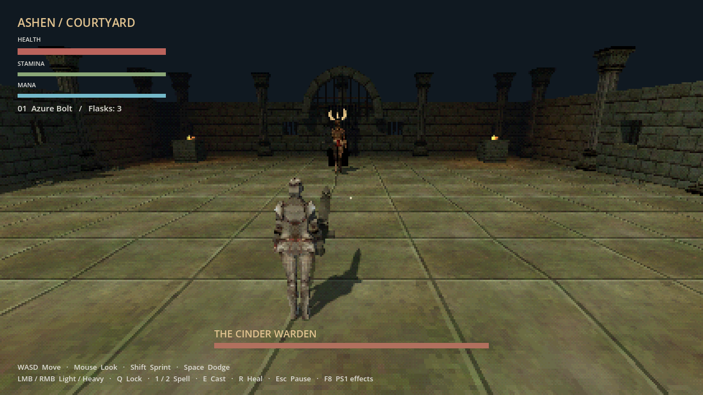
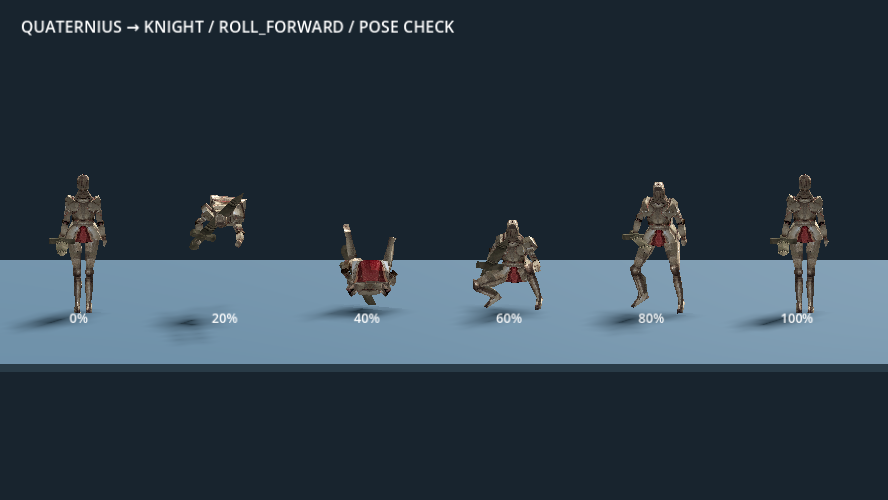
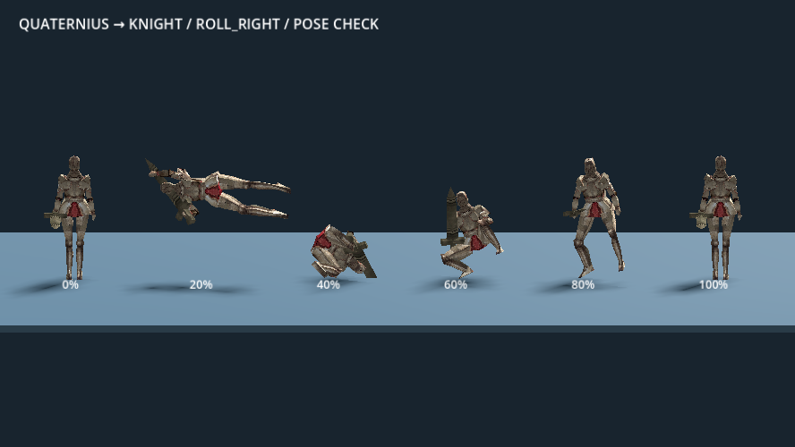

# Ashen Courtyard — Retro Lowpoly Dark Fantasy Souls-like prototype

The guiding art direction is **Retro Lowpoly Dark Fantasy**: deliberate low-poly
shapes, a retro sensibility, and dark-fantasy atmosphere. Texture treatment,
resolution, dithering and lighting remain creative choices. Follow the approved
[concept-art workflow](art_source/concept_art_workflow.md) and
[brief template](art_source/concept_brief_template.md). Existing PS1 rendering
effects describe the current prototype rather than fixed requirements for new art.

The [Soulbound HUD preview and editable source](art_source/ui/soulbound_hud/README.md)
are saved in the project. Open its `index.html` offline; see the
[development snapshot](art_source/ui/soulbound_hud/docs/DEVELOPMENT_PROGRESS.md)
for approved visuals, Soul refill behavior and modification instructions. The
[six-stage mana evolution](art_source/ui/soulbound_hud/docs/MANA_EVOLUTION.md) is
implemented in that preview, with a 100–300 mana progression and full-mana aura.
This is a visual prototype; integration into the game's HUD remains deferred.

A third-person sword-and-magic encounter in a textured, ruined courtyard.
The shared player's [fitted hitboxes and head-based breath](docs/HITBOXES.md) can be
inspected through **Esc → Debug → Fitted hitboxes / breath**.
Built and validated with **Godot 4.6.2 stable (71f334935)**, **GDScript**, and the
**Compatibility** renderer. The adjacent Python Snake project is unchanged.

For a current progress snapshot and context for continuing development, read
[GAME_CONTEXT.md](GAME_CONTEXT.md). The reusable character foundation is documented in
[ARCHITECTURE.md](ARCHITECTURE.md); future delivery gates are in
[DEVELOPMENT_ROADMAP.md](DEVELOPMENT_ROADMAP.md). See the [Milestone 1 review](docs/FOUNDATION_REVIEW.md)
for native captures and validation.

The [Section 2 ownership follow-up](docs/SECTION2_REVIEW.md) documents the shared
player/AI action lifecycle, queued costs, explicit spell aim and presentation
boundaries. The earlier baseline passed 1,347 checks / 22 suites. See the
[earlier get-up regression report](docs/validation/get-up-final.json).

The [shared motion walkthrough](docs/MOTION_PIPELINE.md) shows the implemented
file tree and player/AI call flow. Motion requests, ground/air policies and travel
budgets now use a shared simulation step. The preserved pre-ledge baseline passed **1,973 checks / 31 suites**; see the
[ledge baseline](docs/validation/ledge-final.json): **2,140 checks / 37 suites pass**.
The [sideways hanging and corner extension](docs/LEDGE_SHIMMY.md) now passes
**2,254 checks / 40 suites**; see the [latest full results](docs/validation/shimmy-final.json).



## Run

On this computer, open **Desktop → Ashen Courtyard → Play Game**, or use
**Open Editor** and press **F5**. Stop and restart an already running game to
load changes.

On another computer, install Godot 4.6.2 standard, import `project.godot`, let its
assets finish importing, and press **F5 / Run Project**. No runtime downloads,
Python packages, or editor plugins are required. The courtyard is assembled at
runtime, so the main scene initially appears empty in the editor.

The player now uses the UAL mannequin and UAL2's regular sword A/B light combo.
With default controls, left-click to attack and click again within the combo
window for B. The Warden keeps its Knight model. See
[sword animation setup and playtest](docs/UAL_SWORD_ATTACKS.md).

From this directory, with Godot on PATH:

```sh
godot --path .
# Same encounter with a stationary practice target:
godot --path . -- --training
```

## Character Test Grounds

**Items:** open **Esc → Test Grounds → Item testing** in the lab to grant test
items, assign hand/spell/gadget slots, inspect quantities and charges, and upgrade
individual copies. The existing sword, spells and flask now use this shared
system. Bow/shield entries are equipment fixtures; their combat is still deferred.
See the [item system and authoring guide](docs/ITEM_SYSTEM.md).

**Sideways hanging:** choose **Esc → Test Grounds → Corner tests** in the lab. While hanging,
Left/Right moves along the ledge and automatically rounds safe connected corners.
[Controls, footage and implementation](docs/LEDGE_SHIMMY.md).

**Ledge review:** choose **Esc → Test Grounds → Ledge tests** in the Test Grounds. Jump toward a
wall, release Forward to hang, hold Forward to pull up, and use Dodge to let go.
The course includes 1.5 m / 2.5 m walls and blocked/excluded cases. Hanging costs
nothing and does not regenerate stamina; pull-up costs 10. See
[animation, architecture, mathematics and validation](docs/LEDGE_GRAB_PLAN.md).

**Supported get-up:** surviving ragdolls now use the approved **1.20 s** hand-plant,
kneel and rise, with a separate face-up entry.
[Animation clips, code ownership and testing](docs/GET_UP_RECOVERY.md).

**Cliff-dive refinement:** forward motion continues until ground contact. A fresh
Dodge press in the final 0.15 s costs 25 stamina for a quick grounded roll and
50% fall damage on nonlethal heavy impacts. Failed heavy cliff dives ragdoll;
survivors settle and get up. Try **Esc → Test Grounds → 8 m drop → Start fall test** in the lab.
[Behavior, architecture and footage](docs/CLIFF_DIVE_LANDING.md).

**Milestone 2.2 — jumping, falling, landing and ragdoll:** Space jumps and Alt
dodges for fresh/default bindings. Existing bindings are preserved; follow the
on-screen guide or use Settings → Controls → Reset to defaults → Apply. Jump rises 1.2 m, costs
15 stamina and retains momentum with very little steering. The lab Esc menu now
has selectable drop heights and **Drop + hit** for descending-hit ragdoll tests.
Walk off the selected platform; surviving ragdolls settle and automatically get up.
See [controls, architecture, footage and review](docs/MOVEMENT_02_JUMP_FALL_LAND.md).


**Milestone 2.1 — running and dodging:** open the lab's **Esc → Test Grounds → Movement practice**
menu for running/gap courses or optional hub combat. Choose a stationary target
for lock-on/action transitions, or timed overhead attacks for dodge practice.
Station reset restores both characters; player death restarts the attempt. Leaving
the hub disables practice combat. **F3** toggles compact live diagnostics.
Use **Esc → Debug → Actions** for dodge phase, remaining travel, rise, immunity
and the last action result.

**Forward-dodge motion preview:** open `scenes/dodge_preview.tscn` and press
**F6**. Replay, pause, frame-step, and quarter-speed controls are included.
This is a separate review scene; see [DODGE_PREVIEW.md](DODGE_PREVIEW.md) for
moving previews and validation. The Test Grounds now enable the new forward
dodge in every level: press Dodge from standing or while moving forward.
The old hop and comparison switch have been removed. Both worlds use the referenced
**0.70 s grounded side/back rolls**, without a hop; [preview and details](docs/GROUND_ROLLS.md).

**Adaptive clearance:** the forward dive clears low obstacles up to 0.60 m and
the tested 0.60 m → 1.00 m platforms across 0.5/0.6 m gaps. Try the two marked
lanes at **02 Jumping**, or open `scenes/dive_clearance_preview.tscn` and press F6
for a controlled replay. [Native footage, tuning and checks](docs/DIVE_CLEARANCE_PLAN.md).

A separate **140 × 120 m graybox movement lab** is available. Open
`scenes/movement_lab.tscn` and press **F6 / Run Current Scene**. F5 and Play Game
still launch the courtyard. The lab has eight test stations, a central hub,
station navigation/reset, camera options, and **F3** diagnostics. Running now
includes momentum, dynamic animation, and 0.60 m step-up; the other planned
movement abilities after jumping remain inactive.

See [MOVEMENT_LAB.md](MOVEMENT_LAB.md) for the map, controls, implementation,
validation, and the one-mechanic-at-a-time roadmap.

## Controls

| Input | Action |
| --- | --- |
| WASD / mouse | Move relative to the camera / look |
| Shift | Sprint; costs stamina |
| Space | Jump (fresh/default bindings) |
| Alt | Dodge; forward dive when standing still (fresh/default bindings) |
| Left mouse | Tap for light combo; hold to charge heavy during sword pullback; release early to cancel |
| Right mouse | Heavy attack |
| Q | Toggle boss lock-on |
| 1 / 2, then E | Select Azure Bolt / Violet Burst, then cast |
| R | Heal with one of three flasks |
| Esc | Pause/resume and release/capture the mouse |
| F4 | Toggle pixelation, dithering, vertex jitter, and texture warping |

The F4 preference survives encounter retries during the current session.
F8 is reserved by Godot to stop editor-launched games. Older saved F8 PS1
bindings migrate to F4 (or a free letter key if F4 is already assigned); other
custom controls are preserved. Effects can also be applied in Settings → Display.
Textures and distance fog remain when effects are disabled. The pause/retry menu
includes **Asset credits**, with links to the original creators and licenses.

## Shoulder camera and options

Press **Esc → Settings → Camera**. Edits remain a draft until you choose Apply.
Choose left/right shoulder, field of view (50–95°), distance (2–6 m), shoulder
offset, height, mouse sensitivity, follow smoothing, and inverted vertical look.
**Apply** saves the selection and keeps the editor open. **Reset to defaults**
stages the original framing; choose Apply to confirm. Back/Esc prompts before
discarding unapplied changes. Preferences survive retries and game restarts in
`user://camera_settings.cfg` (Godot's local application-data folder).

The default is right shoulder, 65° FOV, 3.8 m distance, and 0.12 s smoothing.
Lower smoothing makes the camera respond faster; zero removes follow delay.
Lock-on smoothly aims at the enemy while retaining the shoulder offset.

`scripts/shoulder_camera.gd` follows the character body, so rolls and sword poses
do not shake the camera. Exponential smoothing gives consistent follow timing.
Orbit smoothing tracks continuous mouse rotation, avoiding direction reversals
when fast turns exceed 180° of camera lag. `tests/run_camera_fast.gd` covers
fast grounded turns at 30/60/120 Hz on both shoulders.
A sphere sweep protects the sideways shoulder pivot and `SpringArm3D` retracts
the camera behind it when walls obstruct the view. Movement uses the visible
camera's horizontal heading. Spell aiming continues to use the center reticle.
`scripts/camera_preferences.gd` validates and saves values, while
`scripts/camera_options.gd` builds the menu separately from combat logic.


## Combat

Read the Warden's amber telegraph, dodge across or away from its attack, and
punish recovery. It alternates a two-swing combo and delayed overhead strike
up close; distance triggers a lunge. Ordinary damage does not stagger it.

Melee, rolls, and sprinting consume stamina. Mana regenerates after a casting
delay. Casting spends mana when the action starts; being hit before release interrupts it
without a refund. Healing also spends its flask when it starts and can be interrupted.
Attacks commit you through recovery, with a 0.2-second single-action input buffer.

Bolts target the locked enemy or the reticle and stop at geometry. Burst affects
enemies within four meters, checking for intervening walls. Death/victory opens
Retry, which restores resources and removes strike history and projectiles.

## Current rendering and assets — earlier PS1 treatment

- **Characters:** the player uses Quaternius's UAL mannequin as a temporary base
  for future knight art. The Warden uses a larger, tinted Luana Coppio Fullplate
  Armor Knight with our original crown, cape, and greatsword. That downloaded GLB
  was missing half of its mesh; `tools/prepare_psx_knight.py` generates a repaired
  copy with mirrored skin weights.
- **Environment:** Goblinatron's PSX Dungeon meshes and texture atlases replace
  the flat-color courtyard. Imported meshes are recentered and scaled at runtime;
  simple floor/boundary colliders keep movement stable.
- **Rendering:** `shaders/psx_surface.gdshader` applies nearest-filtered textures,
  vertex lighting, distance fog, mild jitter, and mild affine UV warping.
  `shaders/psx_screen.gdshader` samples a 426×240 grid and dithers to 5-bit channels.
  Combat still updates at the normal physics rate, and the HUD stays sharp.
- **Attribution:** [CREDITS.md](CREDITS.md) and the in-game credits identify sources,
  modifications, and licenses. The dithering pattern was adapted from snotbane's
  Unlicense PSX Visuals shader; its full editor conversion plugin is not installed.

These are original freely licensed assets from their creators, not extracted
Elden Ring assets. The earlier generated models remain under `assets/models/`.

## Scene structure and learning milestones

1. **Movement:** `scenes/arena.tscn` creates the player, Warden, HUD, effects, and
   `scenes/dungeon_courtyard.tscn`. `CharacterBody3D` resolves movement and
   `SpringArm3D` shortens the camera arm near walls. Try moving around the perimeter.
2. **Melee:** `features/abilities/ability_controller.gd` owns explicit action states. Windup, active, and
   recovery windows control damage and action commitment. Use training mode to
   practice timing against a stationary target.
3. **Encounter:** `scripts/boss.gd` cycles through approach, telegraph, attack,
   and recovery. Retry reloads the complete scene.
4. **Magic:** the projectile scene sweeps its path each physics frame to prevent
   tunneling. Burst checks distance and world occlusion instead.
5. **Presentation:** the HUD listens to health/resource signals. The player's
   `scenes/models/ual_player.tscn` uses shared native UAL locomotion/light-attack
   clips and socket-based equipment. `psx_warden.tscn` keeps the legacy Knight
   adapter. Temporary action adapters remain explicit; collisions stay separate
   from art. See the [UAL foundation](docs/UAL_FOUNDATION.md).

`Combatant.receive_damage(DamageRequest) -> bool` is the shared damage interface.
It rejects dead/invulnerable targets and repeated victims in a strike token. Tokens
are owned by an action/projectile; separate swings receive separate tokens.
`take_damage(amount, strike_id)` remains a bounded compatibility adapter.
Physics layers: **1 world, 2 player, 4 enemy**.

## Directional dodge animations

The knight uses Quaternius's **CC0 Universal Animation Library Standard** `Roll`
clip, adapted to its simpler skeleton. Forward uses the transferred roll;
left, right, and backward use locally created torso-motion variants with the
same limb articulation. These are four separate animation resources.
Direction is chosen relative to the character's facing when the dodge begins.
Use **Q** to lock on, then **A/D + Dodge** to clearly see the lateral rolls.
Standing still and pressing Dodge uses the forward dive in every level.

The collider stays upright while the skeleton crouches, tucks, rotates and
recovers. Side/back directions start their selected clips immediately on the floor,
with **no physical hop**, **0.70 s** playback and **4.34 m** requested travel.
Existing motor step-up supports 0.60 m obstacles with headroom checks. Falling off
an edge pauses the grounded pose clock; landing resumes it without renewed lift
or immunity. The clips' authored hip motion is preserved.

`features/abilities/ground_roll.gd` owns per-instance timing and requests movement
through the shared motor. `scripts/psx_knight.gd` samples the original clips with
a 0.08 s entry blend. Cost remains 25 stamina; immunity is 0.06–0.32 s from roll
start. See [ground-roll footage and verification](docs/GROUND_ROLLS.md).

The adaptive **forward** dive is shared by the courtyard, Test Grounds and
preview. It retains preparation, flight and a 0.55 s grounded finish. The old
hop implementation and comparison switch are removed. See
[DODGE_PREVIEW.md](DODGE_PREVIEW.md) and [shared-dodge review](docs/UNIFIED_DODGE.md).
The original library and license live under `assets/third_party/quaternius/`;
only the four baked clips under `assets/animations/` are needed at runtime.

To regenerate the clips after modifying the skeleton or bake settings:

```sh
godot --headless --path . --script res://tools/build_roll_animations.gd
```





## Tuning

Select the focused `.tres` files under `features/character/data/`,
`features/abilities/data/` and `features/combat/data/` in Godot.
`data/locomotion.tres` controls presentation. `data/combat.tres` now groups these
profiles; its old scalar names are read-only compatibility views. Starting balance
is 100 player HP and 1,500 boss HP, targeting a roughly two-minute successful
fight; that duration still needs hands-on balancing.

PS1 effect strength is in the two shader files. `PSXStyle` creates cached materials,
and `retro_effects.gd` handles the screen pass and F4. The effect changes the rendered
image, not gameplay positions or attack timing.

## Validation

For reproducible setup, CI and a tested Linux release, see
[Development and release checks](docs/DEVELOPMENT.md). The workflow pins Godot
4.6.2, validates a clean import, runs regressions, and smoke-tests the exported game.

Run all checks through the single runner (Python standard library only):

```sh
python3 tools/run_tests.py
python3 tools/run_tests.py --suite run_architecture --suite run_camera
python3 tools/run_tests.py --self-test
```

The runner prefers the project toolchain installed by `tools/install_toolchain.py`,
then Godot on PATH or the desktop engine on this computer. Override it with
`--godot` or `GODOT_BIN`.
Use `tools/check_project.py` to import a fresh checkout automatically. Suites use
isolated temporary settings, and script errors fail the run even if Godot exits
successfully. JSON and raw logs are written under `.artifacts/tests/`.

**Milestone 1: 717 checks across 16 suites pass**, plus six runner self-checks.
This includes 32 ownership/atomic-cost/environment-independence checks and a
37-check preview suite using the real character at 30/60/120 Hz. See the
[review report](docs/FOUNDATION_REVIEW.md) for the baseline and full results.
The following are individual suites within that total:

After the preparation and adaptive-clearance refinements, the current full run
passes **828 checks across 18 suites**. The [clearance report](docs/validation/adaptive-clearance.json)
records the current result; the Milestone 1 report remains the historical baseline.

**62 checks passed, 0 failures** on Godot 4.6.2: resource costs and caps, attack
windows, duplicate hits, dodging, interrupted casts, projectile/geometry collisions,
burst range and occlusion, healing, boss patterns, camera walls, lock loss,
pause/resume, victory/death, repeated retries, imported mesh completeness,
hand/weapon attachment, and the retro-effects toggle across retries.

**33 additional camera checks passed:** both shoulders at every boundary and
corner, sideways collision, smoothing, clamped configuration values, lock-on,
target loss, live paused preview, sensitivity/inversion, configuration save/load,
retry persistence, and returning from options on the death screen. Camera tests
use a separate temporary settings file and do not replace personal preferences.

**28 dodge checks passed:** ground clearance at 241 points per clip (including
between baked keys), distinct directional poses, input selection, standing dodge,
resource costs, immunity, recovery, interruption, and retry. Lowest sampled mesh
clearance is 1.6 cm. The mesh check covers the knight's body; it does not claim
that a held weapon can never touch scenery.

Rendering checks require a display; Linux can prefix these with `xvfb-run -a`:

```sh
godot --path . --audio-driver Dummy --script res://tests/render_preview.gd
godot --path . --audio-driver Dummy --script res://tests/render_models.gd
godot --path . --audio-driver Dummy --script res://tests/render_rolls.gd
```

They write gameplay, menu, credits, and character screenshots to `/tmp` for
inspection. The shaders were checked under Compatibility using a virtual display.
Current native courtyard/lab/shared-preview captures also ran on the actual Iris Xe GPU.
Release performance and hands-on combat feel remain separate review gates.

## Limits

One local encounter; keyboard and mouse; one sword; two spells. No saving,
leveling, inventory, controller support, multiplayer, or open world.
Player light attacks use native UAL2 A/B clips. Heavy attacks, casting and other
unconverted actions retain temporary adapters; rolls are adapted skeletal
animations. The prototype still lacks a complete authored combat-animation set.

## Keybindings

Open **Esc → Settings → Controls** in either the courtyard or Character Test Grounds.
Click an action's binding, then press a keyboard key or mouse button. Scroll for
additional actions. Duplicate bindings are rejected with the conflicting action
shown. Mouse wheel bindings and key combinations are not supported.

Choose Movement, Combat, Interaction, or Interface & Debugging. Interaction is
empty until those mechanics exist. The last selected category is remembered
across menu visits, levels and restarts, without needing Apply. **Apply** saves
binding changes and stays open.
**Reset to defaults** stages defaults for every binding category; Apply confirms.
Back/Esc prompts before discarding unapplied edits. Escape cancels input capture
and always remains a menu shortcut, even
when Pause is assigned another key. On-screen guides reflect saved bindings.

The shared menu is in `scripts/keybinding_options.gd`. `scripts/game_input.gd`
validates and saves bindings in `user://keybindings.cfg`, then updates Godot's
InputMap so both scenes use the same controls. Camera settings stay separate.

Run the focused checks with:

```sh
godot --headless --path . --script tests/run_keybindings.gd
```

These 34 checks cover persistence, invalid settings, conflicts, save errors,
keyboard/mouse capture, cancellation, default restoration, and both menus.
They use a temporary settings file without changing your saved controls.

## Dynamic running animation

The knight now uses separate jog/sprint cycles with ramp foot placement,
smoothed turn lean, and S-turn transitions. See [running animation notes](RUNNING_ANIMATION.md)
for test instructions, editable tuning, and validation.

Lock-on keeps the camera and knight facing the enemy during idle and walking.
Holding Sprint with movement input turns the knight toward travel, even with
empty stamina. Releasing Sprint smoothly restores target-facing. Committed
actions retain their existing facing; attacks and spells face the target when started.

Running now builds momentum, brakes before full 180° reversals, and slows to a stop
when movement is released. Forward lean follows speed; S-turns receive 15%
more turn lean. See `RUNNING_ANIMATION.md` for values and checks.

Diagonal transitions and S-turns preserve speed: steering changes heading
separately from acceleration, without a diagonal speed boost.

The knight automatically steps onto obstacles up to **0.60 m**, with full-body
ceiling/landing checks. Try the labeled blocks at **01 Running** in the lab.

The shared forward dive adapts to nearby 0.60 m obstacles and the tested
0.60 m → 1.00 m platform crossings over 0.5/0.6 m gaps. The separate Jump
action now rises 1.2 m and does not alter dive tuning. The 3 m gap lane from a 0.45 m setback exceeds the current
shallow dive's airborne reach and safely resets on a miss. See
[clearance tests](docs/DIVE_CLEARANCE_PLAN.md).
Walking, sprinting and grounded side/back rolls retain slope-aware 0.60 m step-up
on ramp sides; the latter have no launch arc.

## Shared menu and debugging

Press **Esc** in either level. The sidebar groups Settings, Test Grounds, Debug,
Credits and Quit; Back returns through the previous pages. F5 still launches the
courtyard; F6 on `scenes/movement_lab.tscn` launches the lab.

- **Settings:** Camera, categorized Controls, and Display (PS1 effects). The last
  Settings tab is remembered across levels and restarts without needing Apply. Each
  editor shows Apply only after changes and has Reset to defaults. Leaving with
  unapplied changes offers Apply changes, Discard, or Keep editing. Existing saved
  preferences are retained.
- **Test Grounds:** enter the lab from the courtyard; in the lab select stations,
  ledge/corner tests, fall tests, movement practice, resets or return to courtyard.
- **Debug:** pauses for Movement, Actions, Resources, Camera, Contacts and Events.
  Hand anchors, pull-up route and collision capsule are optional visual overlays.
  **F3** toggles a compact live overlay; both debug interfaces start hidden.

Run interface checks with `python3 tools/run_tests.py --suite run_menu`.
UI scenes and styling live under `features/ui/`; diagnostics observe character
components and settings editors publish their drafts only on Apply.

### Repeatable performance check

`tools/benchmark_lab.gd` compares the full lab with the same lab plus four active
wardens, using native rendering, 4 seconds of warm-up and 15 seconds of samples
per case. Run without `--headless` or `--fixed-fps`. See
[performance results and reproduction](docs/PERFORMANCE_BASELINE.md).

### UAL player and appearance review

The normal player uses the UAL mannequin with a sword-only loadout, following
Neth's approval. `res://scenes/ual_validation.tscn` (open and press F6) retains
the full modular-armor review. Open **Esc → Appearance** for armor,
equipment-layout and socket-label controls. The bow is a marker, not new weapon
gameplay. Final knight artwork remains subject to consultation and review. See the
[UAL foundation](docs/UAL_FOUNDATION.md) and
[Blender character guide](docs/BLENDER_CHARACTER_WORKFLOW.md).

## Swimming

Open **Esc → Test Grounds → Swimming** to test surface swimming, underwater diving
and automatic ledge exits. Default controls: **C** descend, **Space** ascend,
**Shift** swim faster. Swimming uses native UAL animations, stamina and breath.
See [controls, tuning and playtest route](docs/SWIMMING.md).

## Interactive project tracker

Open **Ashen Courtyard Tracker** from the application menu or the **Open Project
Tracker** shortcut in the desktop project folder. Its local service starts at
sign-in and restarts if it exits; no terminal, Codex task or internet connection
is needed. On another Linux installation, set it up once with
`python3 tools/manage_progress_tracker.py install`.

Visit <http://127.0.0.1:8765/docs/tracker/> for the **Dev book and Art Book**: searchable
features and artwork, acceptance checklists, progress and project-saved reviews.
Opening [the static catalog](docs/tracker/index.html) provides read-only browsing.
See [usage and refresh instructions](docs/tracker/README.md).
