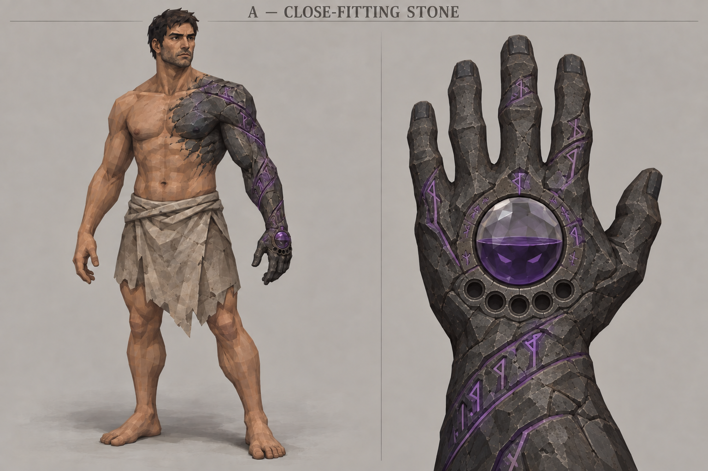
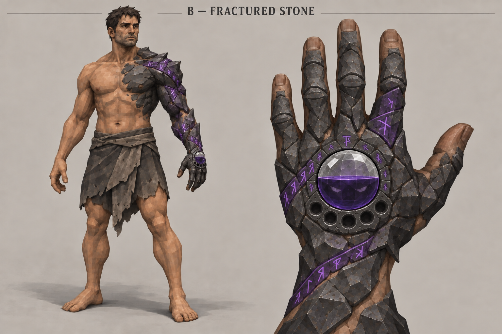
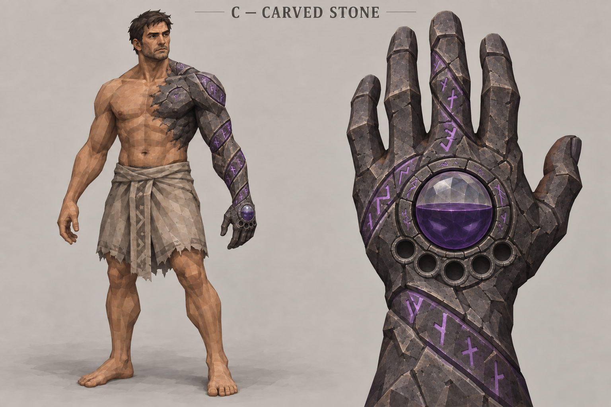

# Awakening of the Fallen Warrior — three-direction review

Status: **Neth selected B — Fractured Stone**, 29 September 2026.
Continue with the [six life-progression forms](life_progression/README.md).
The brief is approved; none of these images is approved final artwork or an
implemented game asset. Generated with the built-in image tool.

## Current review sheets

| Direction | Image | Distinction / tradeoff |
| --- | --- | --- |
| A — Close-fitting stone | [Review v02](direction-a-v02.png) | Quietest body outline and clearest integrated stone skin; subtle differences can disappear at gameplay distance. |
| B — Fractured stone | [Review v02](direction-b-v02.png) | Strongest broken silhouette; exposed skin between plates and at fingertips makes it read more like armor than A/C. |
| C — Carved stone | [Review v02](direction-c-v02.png) | Most readable spiral bands and ceremonial character; wider inscriptions compete more with the hand vessel. |

### A — Close-fitting stone

### B — Fractured stone

### C — Carved stone

## Visual inspection and refinement notes

All three current sheets show the transformation on the character's anatomical
left side, five fingers in the dorsal left-hand inset, a wristward arc of exactly
five empty circular sockets, a surrounding rune ring, and a translucent dome
with a roughly half-full purple liquid level. Engraved violet paths connect the
chest/shoulder to the hand. Submerged eyes are dimmer in B/C than A.

The initial v01 insets showed mirrored hand anatomy. A targeted edit produced
v02 with thumb on the viewer's right in the dorsal left-hand close-up. Keep v01
for generation history, not as the current anatomy reference.

These are exploratory images. Remaining review considerations:

- A uses more small surface fissures than the broad quiet planes requested.
- B exposes fingertips and skin between plates; if selected, clarify the
  continuous transformation and avoid a removable-gauntlet reading.
- C communicates the shoulder-to-hand spiral most clearly.
- All sheets use prominent faceted skin shading. Final texture-noise restraint
  and hand/body motif consistency should be tightened after direction selection.
- Stone currently covers most of the visible left pectoral. Refine the exact
  half-chest boundary with Neth when choosing a direction.
- These are front studies, not joint/deformation validation or orthographic
  production turnarounds. Tiny hand details cannot be judged from the full-body
  view alone. Real gameplay-scale readability remains untested.

No sockets, reserves, transformations, magic behavior or animation have been
implemented. Human joint function is a design target, not proven by a still image.

## Review checkpoint

Neth selected B and approved exploring six permanent maximum-life stages.
The choice is recorded in the [player brief](../player_concept_brief.md).
Neth approved the six explicitly selected life-progression images as revision 03.
Their mapping and style notes are recorded in the [progression pack](life_progression/README.md).
Game implementation remains separate. A/C remain archived explorations.

## Sources and archive

- [Approved brief](../player_concept_brief.md)
- [Original narrative script](narrative_reference.md)
- [Exact generation prompts](prompts.md)
- [Exact hand correction prompts](correction_prompts.md)
- [Source/output manifest](generation_manifest.json)
- [Protagonist proportions](../../../references/MainKnightReference.png)
- [Retro material reference](../../../references/retro_style_reference.png)
- [Main mana gauge](../../../ui/soulbound_hud/concepts/evolution-partial-closeup.png)
- Supporting costume references: [Confessor](https://en.bandainamcoent.eu/elden-ring/elden-ring/characters/confessor)
  and [Dark Crusader](https://www.creativeuncut.com/gallery-46/lotf-dark-crusader-heavy.html).
  Their images were not supplied to the generation calls; full equipment is deferred.

All six PNGs are 1536 × 1024. The current deliverables are the three v02 images.
The Art Book catalogs both versions and the design documents; filenames and this
review identify the current sheets. No approval is inferred from catalog presence.
