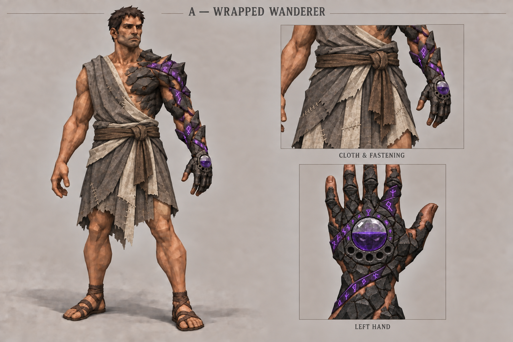
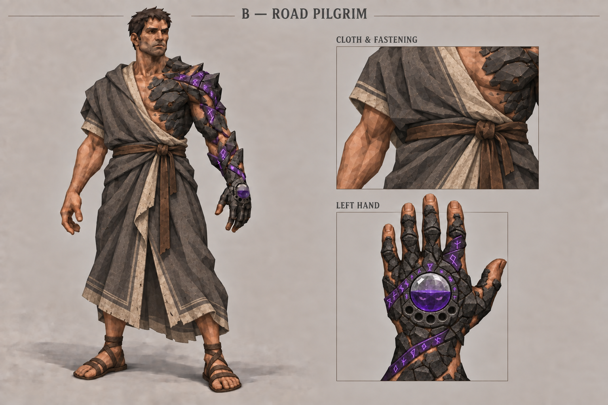
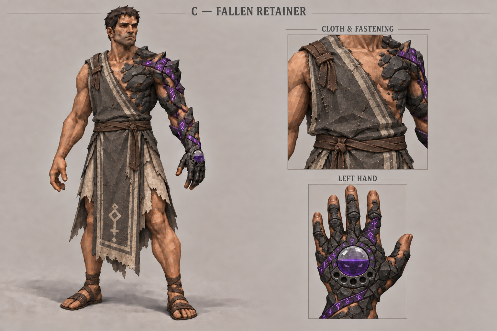

# First travelling outfit — A / B / C

**Status: B — Road Pilgrim approved as the clothing direction by Neth on 29 September 2026.** A and C remain archived explorations. The next palette/style variants are undecided. Game integration is not started.

These three static concepts use the [approved Stage 0 protagonist](../../awakening_concepts/life_progression/stage-0-fractured-v03.png) from the Art Book. The stone and life-progression approvals remain separate from this clothing exploration.

## Directions

| Direction | Clothing idea | Review sheet |
| --- | --- | --- |
| A — Wrapped Wanderer | Short overlapping repaired linen wraps, diagonal right-torso cloth and broad sash. | [A v01](direction-a-v01.png) |
| B — Road Pilgrim | Heavier wool, a gathered waist and a long split skirt with ivory facing. | [B v01](direction-b-v01.png) |
| C — Fallen Retainer | One-shoulder tabard, long bordered panels over a short wrapped skirt and one faded insignia. | [C v01](direction-c-v01.png) |

### A — Wrapped Wanderer

### B — Road Pilgrim

### C — Fallen Retainer

## Approved brief and shared direction

- Retro Lowpoly Dark Fantasy; first travelling clothing after awakening.
- Ash-grey main cloth, dirty-ivory secondary layers, dark-brown leather ties and simple worn sandals. Violet remains on the existing runes and crystal.
- Coarse linen, matte wool and restrained leather; broad readable folds, limited texture detail.
- Old and repaired but serviceable. Draped lower-body garments and exposed lower-leg portions; head uncovered.
- Clothing supported on the normal right shoulder and waist; transformed left chest, arm and hand remain visible.
- Preserve approved identity, build, Stage 0 fracture/flesh pattern, rune route, crystal and five empty sockets.
- Matching full-body pose, framing, neutral background and lighting, with a cloth/fastening detail. A secondary hand inset records the ritual object.
- No armor, animation, rigging, mechanics or game integration in this round.

## Visual inspection

All three outputs retain a recognizable reference identity, left-side transformation, uncovered head, draped clothing, sandals and exposed stone chest/arm. Character scale, pose and lighting are closely matched. The three silhouettes differ in hem length, cloth weight and panel arrangement. Each hand inset shows the left-hand orientation, a roughly half-full purple crystal, and exactly five empty wristward sockets.

These are generated studies, not pixel-identical clothing overlays. Carry the following into the selected refinement:
- A: the hand inset crops the tips of the taller fingers. Its broad brown sash reads more like leather than the intended ash-grey cloth sash.
- B: the lower drape approaches the lower calf; the overlapping front opening implies a movement slit, but a still does not validate stride clearance.
- C: the front tabard and side openings read clearly; the rear panel is only partly observable from this angle.
- Fine glyph shapes and fracture patterns may drift; the approved Stage 0 remains authoritative. Tiny sockets in the full-body view are less verifiable than in the hand insets.
- Faint submerged eyes are not reliably distinguishable in these reduced hand views. Preserve that requirement for refinement; do not treat its visibility as confirmed.
- Shoulder support and waist ties look plausible. Actual movement, rear construction, cloth behavior and gameplay-size readability remain untested.

## Review checkpoint

Next round: [Road Pilgrim — three palette/style variations](../road_pilgrim_variations/README.md). Neth selected burgundy ceremonial, olive patched traveller, and slate-blue monastic, each shown from front/rear three-quarter and walking angles without a hand panel. He authorized the three additional images; outputs now await review.

Neth approved B — Road Pilgrim. Preserve that garment direction and the already approved hand design. Future clothing sheets must not include a separate hand panel. Explore new poses and multiple full-body viewing angles within each image. Palette, style variation and view choices are being clarified before the next generation round. Feedback format: **keep / change / avoid**.
Exactly three images were generated. Any additional images, including corrections and refinement renders, require Neth's permission first. Internet reference searches and interactive previews also require permission. No internet references were fetched and no interactive preview was created.

- [Exact prompts](prompts-v01.md)
- [Source/output manifest](generation_manifest-v01.json)

Earlier approved character sheets and all prior versions are preserved. Historical status of this initial round: Explorations awaiting review, superseded by Neth's explicit selection of B. Art Book inclusion alone does not grant concept approval.
