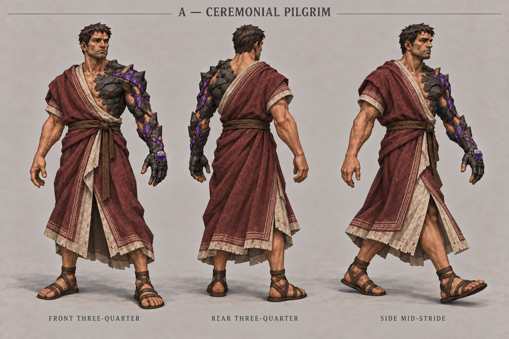
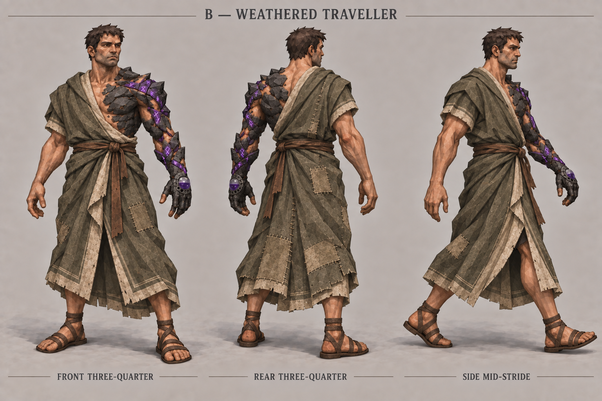
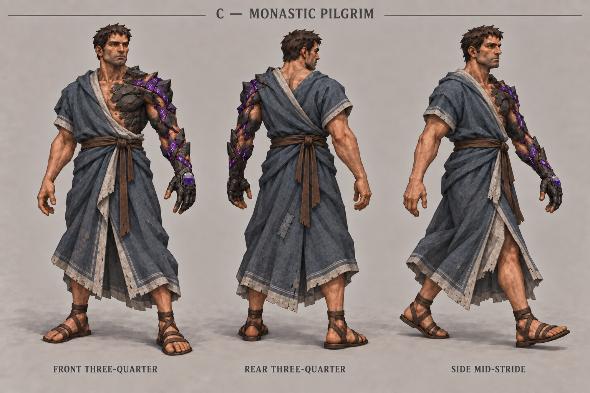

# Road Pilgrim — palette and style variations

**Status: A — Ceremonial Pilgrim approved by Neth on 29 September 2026.** The burgundy-and-bone ceremonial variation is the selected clothing concept, based on the approved [B — Road Pilgrim clothing direction](../first_travelling_outfit/direction-b-v01.png). B/C in this folder remain archived alternatives. Approval selects the clothing; incidental upper-back stone drift does not replace the separately approved character transformation.

## Three matched studies

| Sheet | Palette | Style |
| --- | --- | --- |
| [A — Ceremonial Pilgrim](direction-a-v01.png) | Faded burgundy, bone, dark-brown leather | Worn woven borders and restrained sacred stitching |
| [B — Weathered Traveller](direction-b-v01.png) | Dusty olive, flax, umber leather | Visible repairs, patches and practical ties |
| [C — Monastic Pilgrim](direction-c-v01.png) | Slate blue, ash, dark-brown leather | Plain broad folds, minimal ornament and simple bindings |

Each sheet contains three full-body figures: front three-quarter standing, rear three-quarter standing, and a side-oriented mid-stride pose. No separate hand or cloth detail panels.

### A — Ceremonial Pilgrim

### B — Weathered Traveller

### C — Monastic Pilgrim

## Brief and invariants

The user selected all three proposed palettes paired with these styles, and the front/rear/walking arrangement. Keep the Road Pilgrim's right-shoulder asymmetric wrap, gathered leather-tied waist, long split draped skirt, pale facing, exposed lower shins and worn sandals. No trousers, armor, hood, cape or weapons. Cloth stays matte, weathered and serviceable in Retro Lowpoly Dark Fantasy. Violet remains the existing magical accent.

Use the approved Art Book artwork: Road Pilgrim is the clothing reference and the [approved Stage 0 sheet](../../awakening_concepts/life_progression/stage-0-fractured-v03.png) remains authoritative for body transformation and hand design. Keep identity, proportions, exposed transformed left chest and arm, Stage 0 flesh gaps and fingertips, rune spiral, half-full crystal and five sockets. New views do not authorize redesigning those features.

## Inspection and limits

- All three outputs show three full-body figures with uncovered heads, sandals, draped split skirts and no separate hand panels. Framing, scale, neutral backdrop and light are comparable.
- The palette/style differences are visible: ceremonial burgundy borders, olive repairs, and simpler slate-blue folds.
- Rear garment construction is a new clothing proposal. A and B introduce extra stone across the left upper back/scapula; this is generation drift and is NOT an approved expansion of the transformation. C keeps the back more covered by cloth. Reconcile any selected rear view against the approved character in a later authorized refinement.
- Walking figures retain some front three-quarter visibility, most strongly in A, rather than being strict side profiles. Treat these as posed studies, not orthographic turnarounds.
- Small seams, patches, stone fissures and rune shapes vary between views. Exact construction continuity still needs refinement after selection.
- The approved hand is intentionally not enlarged. Tiny socket counts and faint submerged eyes cannot be reliably verified in every full-body view; these sheets do not replace the approved hand reference.
- Plausible static stride opening does not validate rigging, cloth simulation, animation or in-game readability.

## Review and archive

Neth explicitly approved A — Ceremonial Pilgrim and moved on to conceptualizing the magic rune system. Preserve A's faded burgundy, bone borders, brown leather, asymmetric draped Road Pilgrim cut and restrained sacred stitching. Game integration remains deferred. Historical round status: Palette and style explorations awaiting review, now superseded by this selection.

Review using **keep / change / avoid**, selecting one variant or named elements to combine. The original approved Road Pilgrim and all older sheets are preserved. A/B/C in this folder label color/style variations, not the initial clothing direction choices.

Exactly three additional images were generated with the built-in image tool. More images require permission. Internet reference searches and interactive previews also require permission. No internet references were fetched and no interactive preview was created. Game implementation remains deferred.

- [Exact generation prompts](prompts-v01.md)
- [Source/output manifest](generation_manifest-v01.json)
