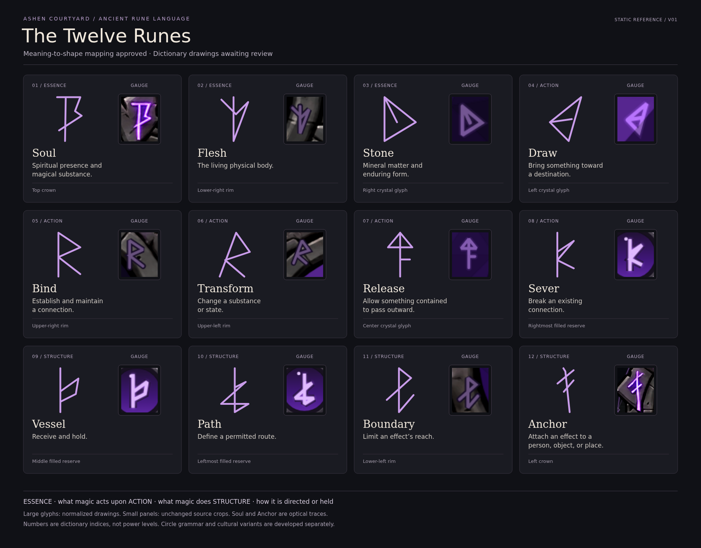

# The Twelve Runes — visual dictionary

Approved rune art direction: **A — Ancient Chisel** from the [A/B/C surface treatments](style_exploration/README.md). Preserve low-poly visuals with clearly visible polygon geometry. B/C remain archived alternatives. Dictionary geometry and the approved meaning mapping remain authoritative; see the [approved style notes](style_notes.md).

**Meaning-to-shape mapping approved by Neth. Dictionary drawings v01 await visual review.**

- [Full-resolution PNG](rune-dictionary-v01.png)
- [Editable, self-contained SVG](rune-dictionary-v01.svg)
- [Approved brief and meaning table](brief.md)
- [Approved magic-circle foundation and remaining questions](magic_circles.md)
- [Paired magic-circle sheets — A approved](circle_exploration/README.md)
- [White canvas geometry experiments A1/A2/A3 — awaiting review](circle_geometry_exploration/README.md)
- [Rune definitions, geometry and provenance](runes-v01.json)
- [Authoring instructions and provenance](prompts.md)

This is one static reference sheet, supplied in PNG and SVG formats. It reuses the approved [mana gauge](../../ui/soulbound_hud/concepts/evolution-partial-closeup.png). Each large glyph is paired with an unchanged view of its source region, its name, meaning and source location. No new image-generation call, internet reference search or interactive preview was used.

## What is approved

Neth chose twelve core concept symbols, retained the existing mana-gauge shapes, and explicitly approved the meaning-to-shape mapping. Players learn to recognize runes in predefined spells, objects and environmental clues; they do not assemble spells in this concept. One ancient language is shared across cultures, with recognizable stylistic variants. Reliable core meanings coexist with mystery in complex inscriptions. Circles can be persistent inscriptions or temporary projections during casting.

## Drawing provenance

Ten glyphs retain their existing point sequences from the HUD sources. Only translation, uniform scaling and standardized stroke presentation are applied. Soul and Anchor are optical transcriptions of the painted crown, rather than recovered original vectors. Their source crops remain alongside them for review. Tiny reserve dots and glow are treated as presentation details, not new semantic marks. No existing HUD or character asset was replaced.

The imported forms are documented individually in the data file. The seven rim/crystal shapes come from `evolutionRunePaths`; the three reserve shapes come from `drawReferenceReserve`. Reserve drawings repeat after three symbols in the existing HUD: the five sockets do not define five new runes. Assigning language meanings does not change reserve mechanics or retroactively prove the gauge is a complete grammatical sentence.

## Review checks

- All twelve approved names, meanings and source locations appear once.
- Essence, Action and Structure categories are shown; numbering is a dictionary index only.
- Imported path coordinates preserve the source shapes. Optical traces need Neth's visual confirmation.
- The sheet is readable at its intended large reference size. Actual gameplay-size glyph readability remains untested.
- Bind and Transform share a branched form; assess their distinction before approving canonical drawings.
- Soul and Anchor preserve the crown silhouettes but simplify painting irregularities. Check their traces against the adjacent source crops.
- The current sheet has no magic-circle examples, cultural variants, animation or game integration. Circle grammar remains a separate design step; structural rules beyond the agreed inscriptions/projections are proposals until reviewed.

Next checkpoint: keep / change / avoid on the clean glyphs, particularly Soul, Anchor, Bind and Transform. Ask review questions in plain text because the user reported disappearing question controls. Do not generate additional concept images or create an interactive preview without the required permission.

## Rebuild

Run `python3 art_source/concepts/magic_runes/build_dictionary.py` from the project root to rebuild the SVG from the saved data. Export it at 1920 × 1500 using a local browser. This modifies the dictionary only, not the HUD. Preserve v01 when making a new review version.
