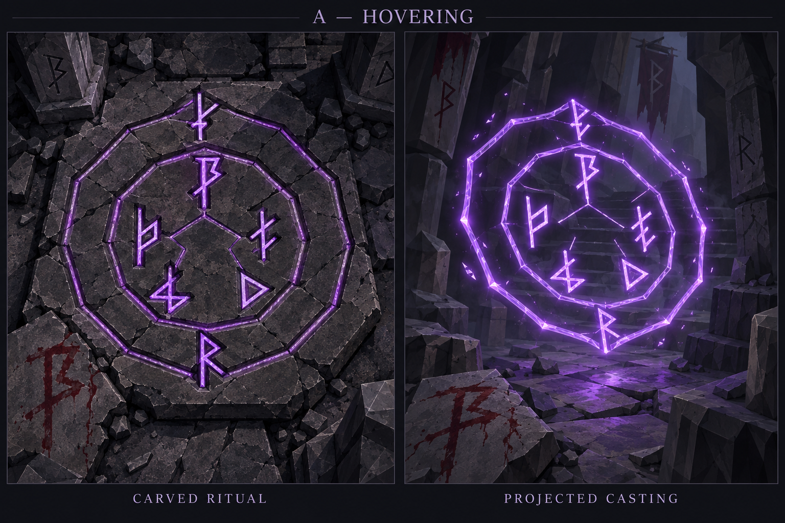
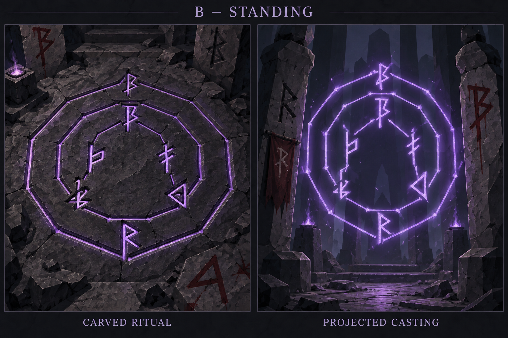
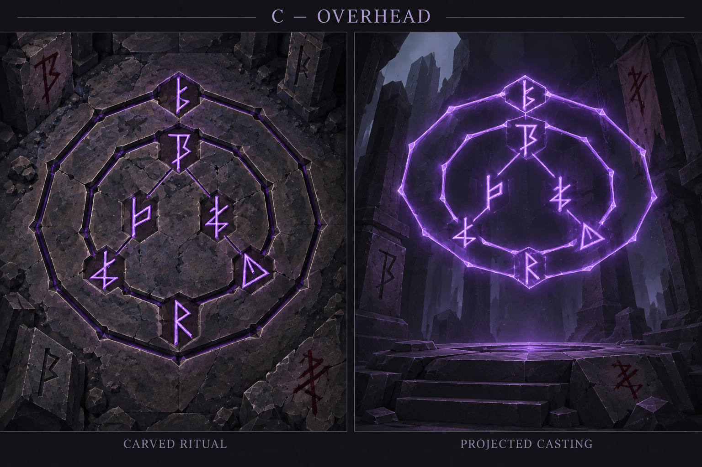

# Magic circles — paired exploration v01

**A — Hovering approved as the visual direction.** B/C remain archived alternatives. Three static concept sheets were generated under the approved three-image limit. Earlier rune dictionary and Ancient Chisel approval remain unchanged. Approval selects A as the reference for future visual experiments; it does not redefine rune meanings or implement magic mechanics.

## Brief

Each sheet pairs a stone-carved ritual circle on the left with its projected casting counterpart on the right, in an environment without characters. Use Retro Lowpoly Dark Fantasy with visible polygon geometry, charcoal stone and violet inscriptions. Include carved runes and dried-blood runes in the surrounding architecture. Blood is an inscription medium here, not a newly defined source of magical power.

Requested composition: two concentric twelve-sided rings. Center: Vessel and Anchor. Operation ring: Soul at 12 o'clock, Draw at 4, Path at 8. Outer containment ring: Boundary at 12, Bind at 6. Each of these seven runes occurs once within each main circle; positions are measured in the circle plane before perspective. Preserve canonical glyph orientation and silhouettes, with angular routes connecting the composition. Environmental inscriptions stay outside the active circle.

Soul collection references recently deceased beings' briefly lingering Soul. These pictures establish neither capture range nor automatic collection rules.

## Sheets

### A — Hovering

Requested staging: RIGHT PANEL: the circle hovers diagonally above a fractured stone floor, tilted approximately 35 degrees so its face is readable and its unsupported height is obvious. Camera sees it from a slightly elevated three-quarter angle. Violet reflected light on the floor, but no second ground circle. Dried-blood rune on a nearby floor fragment, carved marks on the rear wall. LEFT PANEL stays near-top-down carved ritual study.

Review: Projection is nearly upright rather than the requested low diagonal hover. Draw resembles a right-pointing Stone-like triangle. Additional banners and particles appeared.

### B — Standing

Requested staging: RIGHT PANEL: the circle is suspended upright vertically between two broad angular low-poly stone pillars. Camera sees its luminous face from a mild three-quarter angle, close to frontal enough to inspect all seven glyphs. Empty dark space behind it demonstrates transparency, and the base floats above the floor. Dried-blood rune on one pillar face and carved glyph on the other. No doorway vortex, no solid portal surface. LEFT PANEL stays near-top-down carved ritual study.

Review: Upright projection between pillars fits the requested staging best. Boundary is substituted or distorted; apparent interruptions near projected nodes require review under the damage rules. Additional banners and braziers appeared.

### C — Overhead

Requested staging: RIGHT PANEL: a single circle floats overhead above an empty faceted ritual platform, seen from below at a cinematic oblique angle that still reveals its complete design. The plane is nearly horizontal but tilted toward the viewer for clear glyph reading; projection glyphs appear readable from this viewing side, not mirrored. No person underneath. Violet light falls softly onto platform facets. Dried-blood marks on the platform edge and carved glyphs in a background wall. No additional circle carved on the right platform. LEFT PANEL stays near-top-down carved ritual study.

Review: Circle is elevated above the dais but remains largely upright/tilted rather than clearly horizontal overhead. Anchor resembles Path, Draw points incorrectly, and filled polygon node backings appeared.

## Historical generation review findings

- Glyph identities, orientation and placement drift from the approved dictionary; these sheets are not canonical diagrams.
- Vessel and Anchor do not sit together at the true center as requested. Exact twelve-sided ring construction and identical paired layouts are not verified.
- Environmental runes also drift from canonical shapes. Some cracks may interrupt essential inscription paths. Glow is stronger than the restrained brief.
- Visible low-poly architecture, paired carved/projected presentations, and carved plus blood-drawn environmental markings are present.
- Blood is a visual inscription medium only; this round establishes no blood-fuel mechanics.

A is now the approved atmosphere and composition reference. The following generation observations remain documented for fidelity review, without overriding that selection. These sheets are not canonical construction diagrams. Seven visible rune positions do not establish seven correctly reproduced dictionary glyphs. Review exact shapes, ring geometry, central placement, line continuity and projection angles before using the images as functional magic-system references.

## Archive and next checkpoint

- [Exact generation prompts](prompts-v01.md)
- [Sources, integrity metadata and generation record](generation_manifest-v01.json)
- [Approved circle foundation](../magic_circles.md)
- [Canonical rune dictionary](../rune-dictionary-v01.png)
- [Approved Ancient Chisel treatment](../style_exploration/direction-a-v01.png)

All three outputs are preserved as generated. No correction generation was made. A is selected; the next checkpoint is to settle visual and geometry experiments derived from A before further generation. Further generation, including correction images, requires Neth's permission. Internet references and interactive previews also require permission. Implementation remains deferred.

