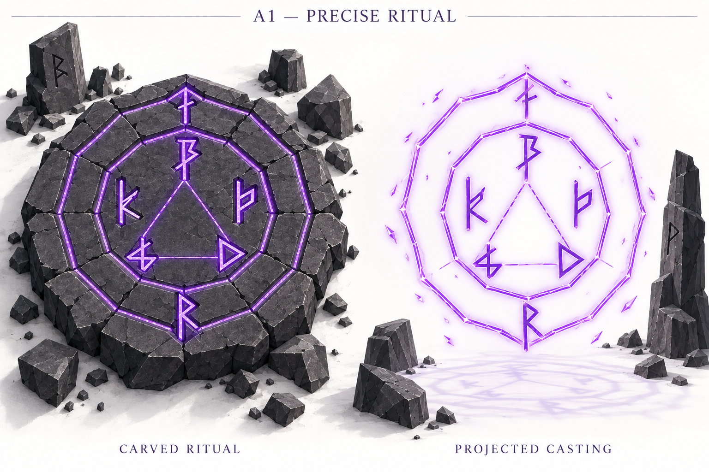
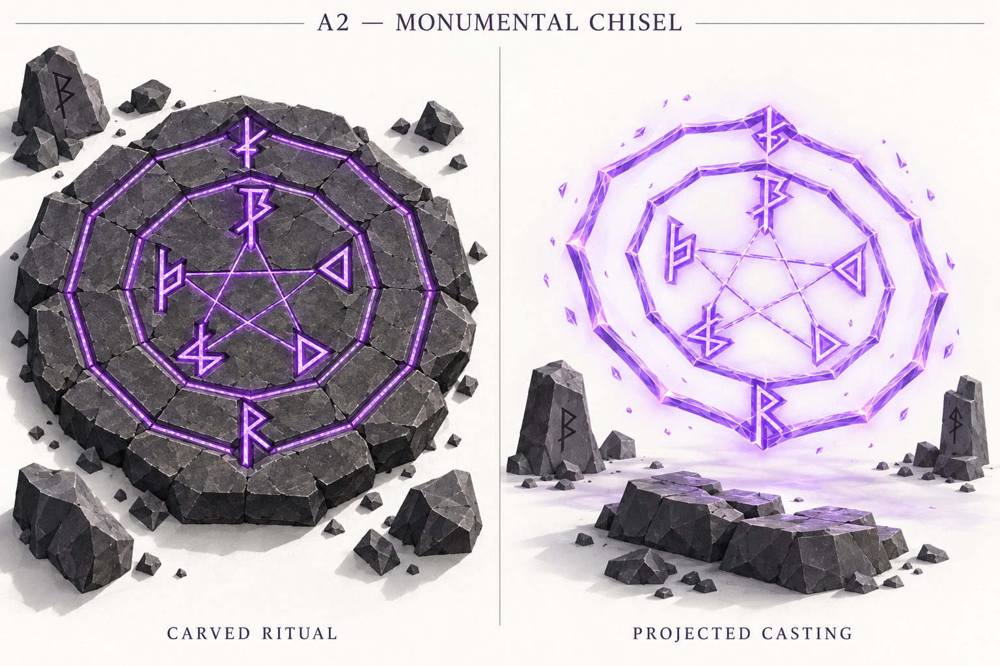
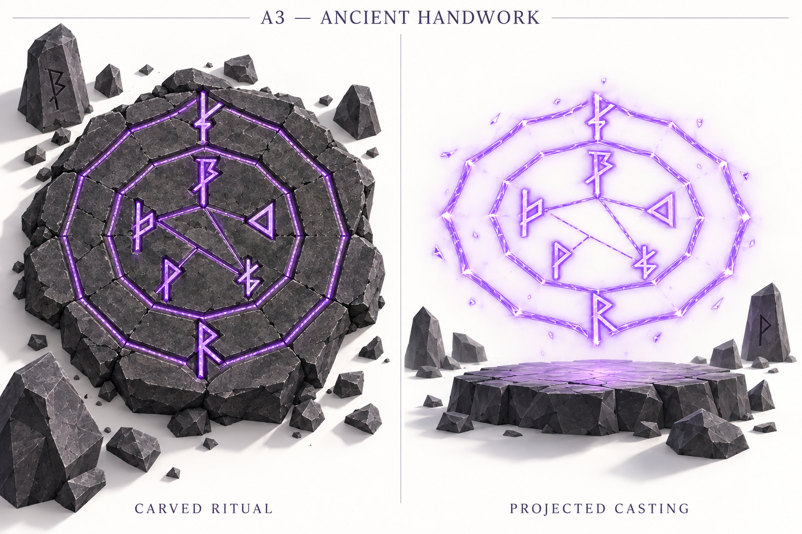

# Magic circles — white canvas geometry experiments v01

**Explorations awaiting review.** These are three new studies derived from approved A — Hovering. The parent approval remains intact; none of these new studies is approved yet.

## Confirmed brief

- Warm-white spatial canvas, white ground, charcoal stone objects, structures and cast shadows. No enclosed dark chamber.
- Exactly two concentric twelve-sided rings, with runes positioned at selected corners and connections forming internal drawings. Unoccupied corners remain empty.
- Pair a carved ritual circle on the left with the same circle projected in violet light on the right.
- A1 Precise Ritual: crisp narrow carving, triangle, upright projection.
- A2 Monumental Chisel: broad bands and deep bevels, pentagram, diagonal projection.
- A3 Ancient Handwork: tapered imperfect carving and worn edges, asymmetric network, horizontal projection.
- Preserve visible low-poly geometry and the approved rune vocabulary.
- **Blood-drawn runes are deferred.** Exclude them; stone-carved environmental runes remain.
- These internal drawings are visual arrangements; no new magical meanings, casting behavior or implementation follows from them.

## Layout interpretation used for generation

This round moves glyphs to ring vertices, superseding the earlier center-pair layout for these experiments only. Each circle requests seven glyphs once: five inner-ring glyphs (Soul, Draw, Path, Vessel, Anchor) and two outer-ring glyphs (Boundary and Bind).

Vertex0 is at the top, numbering clockwise to11. These are prompt construction coordinates, not printed labels or approved magic grammar.

| Sheet | Inner glyph positions | Connection routes | Outer glyph positions |
|---|---|---|---|
| A1 | Soul0, Draw4, Path8, Vessel2, Anchor10 | 0–4–8–0 | Boundary0, Bind6 |
| A2 | Soul0, Draw2, Path5, Vessel7, Anchor10 | 0–5–10–2–7–0 | Boundary0, Bind6 |
| A3 | Soul0, Draw2, Path5, Vessel7, Anchor10 | 0–5, 5–10, 10–2, 5–7 | Boundary0, Bind6 |

A mathematically regular pentagram cannot use only the vertices of a regular twelve-sided ring. The A2 brief deliberately accepts an uneven five-point star while retaining twelve-sided rings. These specific vertex assignments are implementation choices for this visual experiment, not additional user-approved lore.

## Images and review

### A1 — PRECISE RITUAL

Requested: triangle; upright projection.

Review: Triangle and upright projection are visible. Glyphs are predominantly inside the rings instead of centered at selected corners. Draw points right instead of left; other glyph substitutions include the outer top and left interior. Ring segment counts do not reliably match twelve. The material is weathered more heavily than the precise brief.

### A2 — MONUMENTAL CHISEL

Requested: pentagram; diagonal projection.

Review: Pentagram and heavier faceted projected bands are visible. Projection remains near upright rather than roughly 35 degrees above horizontal. Glyphs sit mostly inside the ring, and the intended seven identities and their vertex positions are not reproduced faithfully. Ring side count is not reliably twelve; carved treatment differs only subtly from A1.

### A3 — ANCIENT HANDWORK

Requested: asymmetric angular network; horizontal projection.

Review: Asymmetric connections and a supporting platform are visible, but the projection is upright rather than horizontal. Rings read closer to octagons than twelve-sided rings. Glyph identities and positions drift, and the generated network does not faithfully follow the specified vertex routes. The hand-carved material is only subtly distinct from A1.

## Shared findings

White spatial presentation, paired views, violet light, faceted stones and absence of blood marks are achieved. Internal drawings are visibly different. However, exact twelve-sided construction, vertex-aligned glyphs, canonical shapes and two of the three projected angles are not achieved reliably. Therefore these are exploratory images, not verified circle construction references. Titles and paired labels are present.

All three outputs remain unaltered. No fourth generation or correction was made. Any further generation needs permission. Review with keep / change / avoid; select which successful features should guide refinement.

## Archive

- [Exact prompts and reference list](prompts-v01.md)
- [Generation manifest and integrity metadata](generation_manifest-v01.json)
- [Approved parent direction A](../circle_exploration/direction-a-v01.png)
- [Circle rules](../magic_circles.md)

Concept approval and game implementation remain separate. Internet reference searches and interactive previews require permission.

