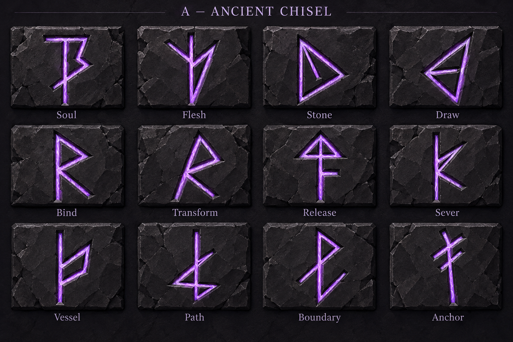
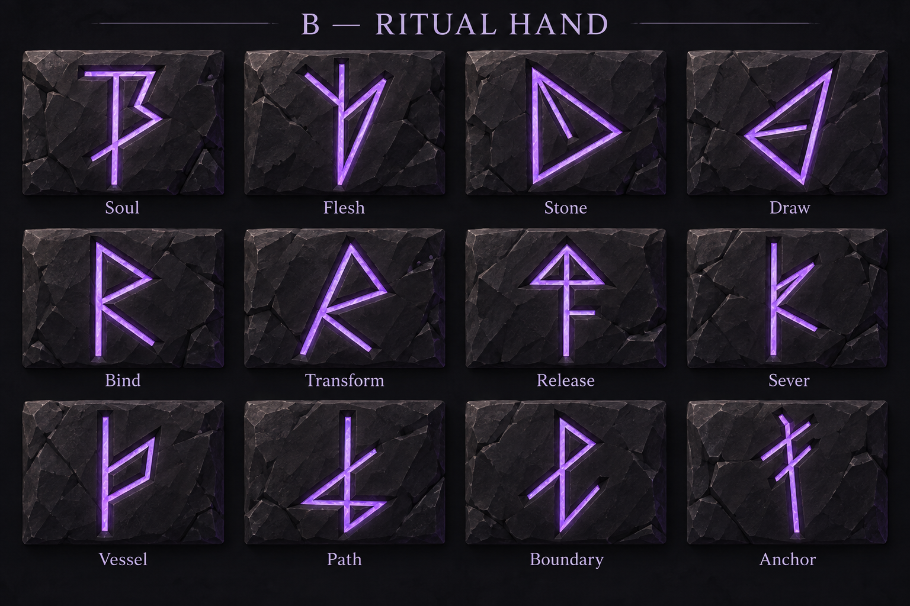
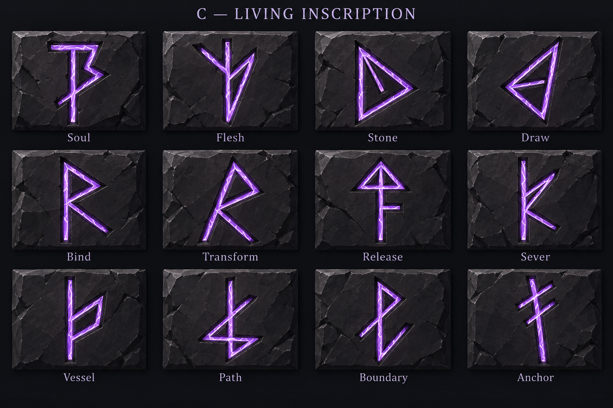

# Rune surface treatments — A / B / C

**Status: A — Ancient Chisel approved by Neth.** Use [A v01](direction-a-v01.png) as the selected rune surface treatment. B/C remain archived alternatives. Preserve the [dictionary](../rune-dictionary-v01.png) and [approved meaning mapping](../brief.md). Future artwork must retain low-poly visuals with clearly visible polygon geometry. Historical round status: Explorations awaiting review, superseded by this explicit selection.

## Review sheets

| Direction | Intended experiment | Output |
| --- | --- | --- |
| A — Ancient Chisel | Deep cuts, uneven widths, chipped edges and restrained weathering | [A v01](direction-a-v01.png) |
| B — Ritual Hand | Deliberate taper, sharp terminals, skilled inscription and cleaner carving | [B v01](direction-b-v01.png) |
| C — Living Inscription | Internal violet energy, fine internal fissures and controlled edge light | [C v01](direction-c-v01.png) |

### A — Ancient Chisel

### B — Ritual Hand

### C — Living Inscription

## Approved brief

Use built-in imagegen for three static raster concept sheets. Reuse dictionary shapes and the [mana gauge](../../../ui/soulbound_hud/concepts/evolution-partial-closeup.png) for material and atmosphere. Retro Lowpoly Dark Fantasy, charcoal stone and restrained violet. No new symbols, semantic flourishes, magic circles, definitions, source thumbnails or additional panels.

All sheets use four columns by three rows, with one name beneath each glyph:
Soul, Flesh, Stone, Draw / Bind, Transform, Release, Sever / Vessel, Path, Boundary, Anchor.

Preserve main strokes, branches, connections, orientation, open spaces and recognizable silhouettes. Vary weight, taper, carving depth, edge treatment and surface finish. Target comparable background, scale, viewpoint, lighting and overall emission across all three treatments.

## Visual review

- Each output has twelve labeled runes in the agreed order; all names are correctly spelled and appear once beneath their corresponding glyphs.
- All use a comparable frontal four-by-three arrangement of charcoal slabs with violet inscriptions. Exact panel dimensions, title spacing and background fracture patterns vary.
- All twelve glyph families remain recognizable, including Soul's crossing branch, Stone/Draw's differing orientation, Release's arrowhead, Path's crossed lower structure and Anchor's two diagonals.
- Bind keeps its upright stem while Transform keeps the slanted stem and triangular branch. They remain similar by design; their distinction should be judged at gameplay size during a later implementation review.
- These are generated interpretations, not exact path reproductions. Stroke width, internal spaces, terminal bevels and junctions drift slightly. The dictionary data remains the geometry authority.
- A communicates deep cut walls and chipped stone, but introduces bright crystalline-looking internal streaks. Its emission is stronger and less restrained than requested.
- B has the cleanest and most regular stroke surfaces. Its taper and calligraphic asymmetry are subtler than intended, and its slab still has extensive fractures.
- C has the strongest internal light/fissure pattern. Bloom remains localized, but its bright cores are visibly stronger than B, so equal glow intensity is not fully achieved.
- A and C overlap more than intended because A also received luminous internal fissures. Do not describe the three experiments as perfectly isolated.
- Fracture texture is busier than the simplified-material target. Texture restraint, emission matching and exact glyph fidelity are refinement points, not approved changes to the language.

## Next checkpoint

Neth selected A and requested visible polygon geometry. Approval supersedes the earlier pending-selection status and does not request a new correction image. Carry the material direction forward as broad faceted stone planes, angular bevels and chips, and visibly polygonal rune recesses with violet light. See [approved style notes](../style_notes.md). Focus next on the magic system; crystal-feeding rules and Skulk/stone-arm relationships are explicitly deferred.

Review **keep / change / avoid** on A/B/C. Preserve the approved mapping and dictionary. Ask Neth before any additional image generation, including corrections. Questions should be plain text because the question controls disappeared for the user.

The three-image limit has been reached for this round. No corrections were generated. No internet references or interactive previews were used. Concept artwork does not implement materials, shaders, HUD changes, animation, cultural variants, circle grammar or game mechanics.

## Archive

- [Exact prompts](prompts-v01.md)
- [Source/output manifest](generation_manifest-v01.json)
- [Parent dictionary and language notes](../README.md)

The original generated outputs are copied without raster edits, and earlier sheets are preserved.
