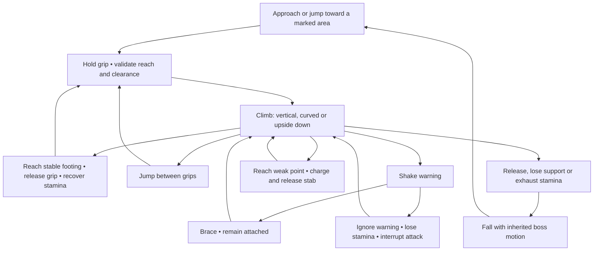
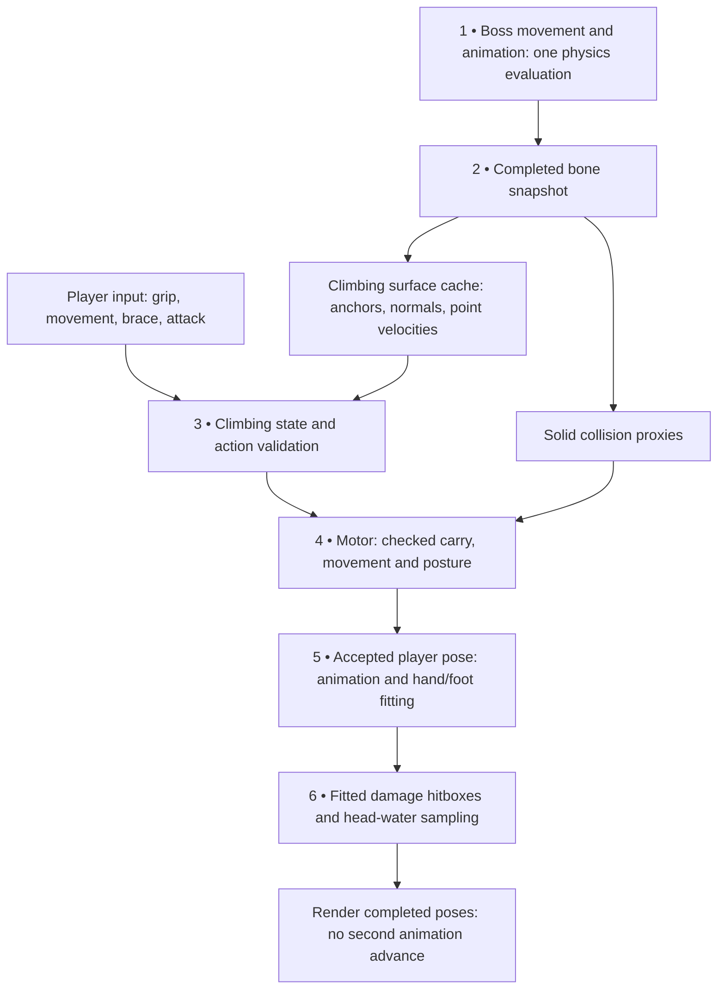
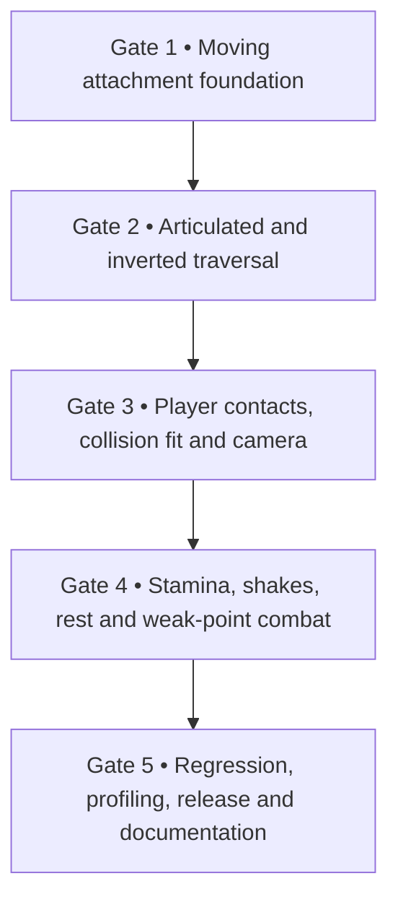

# Boss climbing — implementation plan for an Ultra agent

**Implementation: Planned. Workflow: In progress.**

Current phase: planning and technical design. Gameplay implementation and
acceptance testing have not started. This records the agreed design; unchecked
criteria below must remain unchecked until verified.

DevBook location: **Gameplay → Movement → Boss climbing**. Intended implementer:
an Ultra AI agent. The first delivery is a playable prototype with a simple
articulated giant, using the shared player and existing movement, stamina, combat,
damage, water and animation systems. Preserve unrelated project work.

## 1. Confirmed gameplay

Build a reusable Shadow of the Colossus-inspired system with free movement inside
marked climbable regions. The player can cross curved limbs and animated joints,
hang fully inverted beneath the boss, leap and regrab, rest on stable footing,
brace against telegraphed shakes, and use a charged stab at a weak point.

These choices are confirmed:

- Marked climbable areas, rather than unrestricted climbing on every surface.
- One test encounter first, with a route, resting place, shakes and weak point.
- Hold grip, with a toggle option for accessibility.
- Shared stamina with sprinting and combat.
- Brace in response to a shake warning.
- Charge and release a weak-point stab.
- Climbing, directional leaps and regrabbing while grip is held.
- Existing falling, damage, ragdoll and deep-water entry rules.
- A playable prototype first; final boss art and replacement clips come later.
- W moves up the body using an authored surface direction, independently of the camera.
- Full underside climbing, including completely inverted hanging.

The original developers described the boss as both character and level. Apply
that design idea by giving the body routes, obstacles, recovery places and attack
opportunities. The research reviewed the public
[GDC presentation overview](https://gdcvault.com/play/1013376/Postmortem-The-Emotional-Character-Control),
not the full talk or the original game's engine implementation. The implementation
below is a project-specific proposal, not a claim about that game's source code.

### Controls

All controls remain remappable through `GameInput`. F is the proposed default
grip binding; preserve existing control preferences and resolve any new binding
conflicts at implementation time.

| Input | Climbing behavior |
| --- | --- |
| Hold F | Acquire a reachable grip; release when the key is released. Offer a toggle accessibility option. |
| WASD | Normalized surface movement; W follows authored body-up. |
| Hold Shift | Brace, stop movement and cancel attack charging. |
| Space plus direction | Leap; continue holding grip to catch a valid surface. |
| Hold/release left mouse | Charge and release a stab near a weak point. |
| Release grip at safe footing | Stand and recover stamina. |
| Existing camera controls | Manual orbit and shoulder choice, with an upright horizon. |

### Initial editable tuning

These are initial implementation values, subject to playtesting, not measured
properties of Shadow of the Colossus.

| Parameter | Initial value |
| --- | --- |
| Climbing speed | 0.8 m/s |
| Grip acquisition | 5 stamina |
| Idle / moving / bracing drain | 3 / 6 / 2 stamina per second |
| Leap | 15 stamina; require 20 available to leave 5 for regrabbing |
| Accepted stab | 12 stamina |
| Charge duration and damage | 0–1.25 seconds; 25–60 damage |
| Acquisition reach | 0.65 m from the gameplay hand region |
| Regrab cooldown | 0.2 seconds |
| Shake warning / active interval | 1.0 / 1.5 seconds |

No stamina regenerates while gripping, charging or bracing. Supported standing
uses the existing regeneration delay and rate. Account for partial-tick elapsed
time when applying costs; exhaustion detaches the player.

An unbraced shake removes 20 stamina once, cancels charging and briefly interrupts
movement. Bracing prevents that penalty while its normal grip drain continues.
Unmarked armor and route boundaries block traversal rather than forcing an
automatic fall.

While gripping, disable ordinary attacks, spells, healing, dodging and crouching,
and clear incompatible buffered actions. Ordinary nonlethal damage cancels the
charge and removes 10 stamina, retaining the grip if stamina remains. Death or
an explicit knock-off releases the attachment.

## 2. Moving surface architecture

Store persistent attachment coordinates in the boss surface's local space and
reconstruct them from each completed boss pose. Tracking only a world position
does not handle rotation or articulation. The connection-point and velocity
approach in [Moving the Ground](https://catlikecoding.com/unity/tutorials/movement/moving-the-ground/)
is useful grounding; adapting it to an authored, skinned traversal surface is
this plan's proposal.

| Representation | Responsibility |
| --- | --- |
| Visible boss model | Appearance and animation. |
| Solid collision proxies | Prevent penetration and provide standing support. |
| Authored climb mesh | Define climbable regions, directions, connectivity and persistent anchors. |

Use boxes, capsules and convex proxies for moving solid collision. Do not rebuild
a detailed concave collider every tick. Godot describes
[ConcavePolygonShape3D](https://docs.godotengine.org/en/4.6/classes/class_concavepolygonshape3d.html)
as hollow, relatively slow and intended primarily for static geometry.

Preserve static ledge behavior. The existing moving-transform invalidation in
`LedgeCandidate.valid` is not suitable as the new boss attachment representation.
Introduce a surface provider and an explicitly owned attachment lease. Audit
consumers that currently treat any attachment as a ledge attachment.

### Proposed interfaces

| Interface | Data and ownership |
| --- | --- |
| `BossClimbProfile` | Traversal mesh, bone bindings, triangle adjacency, authored up, standing zones, weak points and tuning. |
| `BossSurfaceProvider` | Completed pose snapshots, surface projection, anchor evaluation and point velocity. |
| `SurfaceAnchor` | Weak provider reference, stable surface/triangle IDs, barycentric coordinates and topology revision. |
| `BossClimbing` | Acquisition, surface movement, resource costs, bracing, release and transfer decisions. |
| Shared attachment lease | Owner kind and support identity; only its owner updates or revokes it. |
| Constrained motion request | Attachment token, target body frame and complete collision posture. |
| Weak-point receiver | Routes a confirmed strike through shared boss damage and death. |

Extend `CharacterIntent` with grip and brace intent; reuse existing movement,
jump and attack inputs where appropriate. The motor remains the only owner that
moves the collision body. Never parent the player's collision body to a boss bone.

### Surface and timing rules

- Use a small climb mesh with stable topology, initially capped at 512 triangles;
  skin only this mesh for traversal queries.
- Triangle identity plus barycentric coordinates follow both rigid and
  articulated motion. Invalidate anchors when their provider or topology changes.
- Author a continuous body-up tangent. Derive sideways motion from that tangent
  and the surface normal. Traverse connected triangles, transport the frame and
  use explicit connections between patches.
- Revalidate live geometry, reach and clearance at joint transitions. Do not
  transfer through a folded joint or across an unmarked gap.
- Use bounded nearby queries. Additional shapes must not exhaust candidate limits
  and hide other characters or valid surfaces.
- Measure point velocity from the same anchor coordinates in consecutive poses.
  Add relative climb/leap velocity once on release, with no duplicated platform
  carry or impulse.
- Use an explicit physics coordinator, not scene insertion order or render timing.
  Publish after completed bone poses and final modifiers. Follow the distinction
  documented by [Skeleton3D](https://docs.godotengine.org/en/4.6/classes/class_skeleton3d.html)
  when selecting the completion signal or manual pose clock.

## 3. Collision, presentation and encounter

### Collision safety

Sweep boss carry plus player movement, including rotation and collision posture.
Check initial overlap as well as motion: Godot's
[physics query documentation](https://docs.godotengine.org/en/4.6/classes/class_physicsdirectspacestate3d.html)
notes that motion casting ignores shapes already overlapping at the start.

Use conservative substeps for rapid motion, bounding displacement of the
capsule's furthest point during rotation. Cap the work and reject unsafe
advancement. Other limbs and world geometry remain solid; never exclude the
entire boss from collision just because one surface is the support.

On blocked carry, retain the last clear pose and attempt a checked outward
release. If no safe separation exists, clamp the offending boss root/pose for
that tick and emit a diagnostic. Do not solve a pinch by teleporting through
geometry or bypassing collision.

Provide fitted gripping, overhang and inverted collision postures. Presentation
follows the posture accepted by the motor. Standing requires an authored standing
zone, headroom and slope at most 35 degrees; lose standing support above 45 degrees
to provide hysteresis. Standing uses ordinary motor support on moving proxies;
gripping uses explicit carry. Only one support owner applies velocity at a time.
Reuse checked mantle movement and its existing 10-stamina cost.

### Animation and body fitting

Use the UAL player mannequin and the verified `ClimbUp_1m` integration. The
installed UAL libraries provide no continuous free-climbing loop. Begin with
authored prototype poses for vertical climbing, movement, bracing, overhangs,
inversion, leaping and stabbing. Audit newly downloaded Mixamo assets before
selecting replacement clips; their presence does not establish verified rig fit.

Drive stepping by distance travelled. Planted hand and foot anchors follow the
boss, with bounded reach and joint rotation. Never stretch bones or translate the
shoulder away from the torso to satisfy a contact. Inverted poses hang the body
below the hands rather than merely rotating a standing pose flat against a roof.
Keep at least one hand attached during a stab.

Disable ordinary walking foot placement while gripping; the climbing solver owns
these contacts. Preserve original animation files, keys and provenance. Introduce
later verified Mixamo clips through an animation profile.

### Camera, damage and lifecycle

- Keep manual orbit, world-up horizon, both shoulder preferences and boss-aware
  camera occlusion. Follow the accepted body pose without inheriting boss roll
  or high-frequency shake.
- Reuse existing stamina and boss-health displays, with contextual controls and
  a shake warning. New HUD artwork is outside this prototype.
- Continue fitted damage sensing and mouth-based breath sampling while gripping.
  Releasing into water hands off to existing swimming and landing protection.
- Pause freezes resource costs and attachment simulation. Resume synchronizes
  poses and input without an accidental attack.
- Reset, teleport, unload and provider removal clear anchors, pose/velocity
  history, equipment overrides and collision posture.
- Boss death stops attacks and shakes, performs a controlled settling motion,
  then leaves stationary solid support for dismounting. Physical corpse
  simulation is deferred.

### First encounter

Add **Test Grounds → Boss Climbing** with an approximately 12 m articulated test
giant and a 240-health head weak point. Use deterministic motion for reproducible
testing. The route includes a lower-leg acquisition, animated joint transfer,
hip/back resting area, fully inverted route beneath a raised arm, approximately
0.6 m leap gap, and head weak point.

Debug materials distinguish climbable areas, armor, resting places and the weak
point; these are not final art. The boss slowly walks, turns and bends, with
telegraphed shakes. Ordinary body attacks meet armor. Only confirmed weak-point
stabs reduce encounter health.

At the active stab contact, validate attachment, weapon capability, range and
obstruction. Route damage through the shared damage/death system and apply it
once per strike, even if several sensing shapes overlap.

## 4. Development gates

The Ultra agent should complete each gate before adding the next layer. Repair
failed safety checks; do not bypass collision or teleport to hide failures.

1. **Moving attachment foundation.** Add the provider, anchors, ownership and
   motor integration. Prove translation, rotation, safe carry and release before
   adding combat. Preserve existing static ledges.
2. **Articulated traversal.** Add connected patches, joint crossings, curves,
   fully inverted traversal, leaps, regrabs, standing and mantle transfers. Include
   blocked and invalid-support fixtures.
3. **Player presentation.** Add prototype poses, planted contacts, equipment
   handling and camera behavior. Validate shoulder continuity, bone lengths and
   collision fit throughout a full animation cycle.
4. **Encounter loop.** Add atomic resource spending, brace timing, charged attacks,
   weak-point damage, deterministic boss behavior and lifecycle handling.
5. **Validation and delivery.** Run focused checks, the full regression runner,
   clean export/release and smoke checks. Complete the laboratory route and
   profiling. Update movement documentation and the context graph, preserving
   unrelated work.

## 5. Validation and acceptance

Run at **30/60/120 Hz physics**, with independent **30/60/144 Hz rendering**.

| Area | Required coverage |
| --- | --- |
| Attachment | Translation, rotation, turns, bends, inversion, provider deletion and topology changes. |
| Traversal | Normalized movement, curved surfaces, seams, armor boundaries, leaps, regrabs and blocked routes. |
| Collision | Thin walls, ceilings, other limbs, initial overlap, blocked carry, failed standing and pinches. |
| Resources | Final partial tick, supported regeneration, insufficient leap/stab stamina and independent characters. |
| Combat | Telegraph, brace, charge interruption, range, obstruction and exactly one damage application. |
| Presentation | Shoulder continuity, bone lengths, hand sliding, completed-pose sensing and animation clock ownership. |
| Lifecycle | Pause, focus loss, remapping, grip toggle, reset, teleport, death, unload, falls and water entry. |

Quantitative checks:

- Stationary-climber drift is at most 2 cm over a 30-second boss motion cycle.
- Planted hands remain within 3 cm of the accepted contact during ordinary
  climbing and bracing.
- Equivalent fixed-input runs differ by at most 0.5 stamina across physics rates.
- Release never applies inherited boss velocity twice.
- No passage through solid geometry or expansion into blocked standing space.
- Two characters remain independent, including when attached to the same boss.
- Profile one boss/player pair and two pairs, separating surface evaluation,
  collision queries and contact fitting. Target less than 2 ms P95 for the
  climbing work of one pair on the actual development machine. Do not use a
  software-rendering run to claim representative graphics performance.

### Recorded DevBook acceptance checklist

- [ ] Moving attachments follow translation, rotation and articulation, with at most 2 cm drift over 30 seconds and inherited release velocity applied once.
- [ ] Traverse marked curves, animated joints and fully inverted undersides; leap and regrab, with unmarked or blocked routes stopping safely.
- [ ] Validate carry, rotation, posture, initial overlap and standing against world geometry and other boss limbs without penetration or unsafe capsule expansion.
- [ ] Keep planted hands within 3 cm of accepted contacts, preserve shoulder continuity and bone lengths, and sample hitboxes and mouth-based breath from completed poses.
- [ ] Verify shared stamina, supported recovery, bracing, charged weak-point stabs and single damage application at 30/60/120 Hz, within 0.5 stamina across equivalent runs.
- [ ] Verify remapped controls, grip toggle, both shoulder cameras, independent render rates, pause, reset, teleport, death, unload, falling, water entry and two independent characters.
- [ ] Complete the hands-on route: approach → grab moving leg → cross joint → hang upside down → leap/regrab → rest → brace → charge/stab → release/land.
- [ ] Pass focused tests, the full regression runner, clean release/export and smoke checks; record profiling and update movement documentation and the context graph.

The hands-on route must remain controllable, show clear stamina feedback and keep
visible and collision geometry consistent. No checklist item is completed merely
because this plan has been recorded.

## Boundaries

This pass is single-player, with one ground-based giant, scripted movement,
ordinary falling rules and prototype visuals. Defer flying bosses, aquatic boss
AI, severed limbs, multiplayer, physical boss ragdolls and final art. Keep the
mechanic reusable, without dependence on the laboratory scene or a particular
boss model.

## Research and implementation references

- [GDC public overview: The Emotional Character Control of Shadow of the Colossus](https://gdcvault.com/play/1013376/Postmortem-The-Emotional-Character-Control).
- [Catlike Coding: Moving the Ground](https://catlikecoding.com/unity/tutorials/movement/moving-the-ground/) and [Climbing](https://catlikecoding.com/unity/tutorials/movement/climbing/): moving support, contact-relative movement and climbing foundations; adapt the ideas to Godot and articulated surfaces.
- [Godot 4.6 AnimatableBody3D](https://docs.godotengine.org/en/4.6/classes/class_animatablebody3d.html) and [CharacterBody3D](https://docs.godotengine.org/en/4.6/classes/class_characterbody3d.html): moving proxies, platform behavior and character motion contracts.
- [Godot 4.6 Skeleton3D](https://docs.godotengine.org/en/4.6/classes/class_skeleton3d.html): pose and modifier timing.
- [Godot 4.6 PhysicsDirectSpaceState3D](https://docs.godotengine.org/en/4.6/classes/class_physicsdirectspacestate3d.html): motion and overlap query behavior.
- [Godot 4.6 ConcavePolygonShape3D](https://docs.godotengine.org/en/4.6/classes/class_concavepolygonshape3d.html): collision representation constraints.
- Project contracts: [architecture](../ARCHITECTURE.md), [motion pipeline](MOTION_PIPELINE.md), [animation](ANIMATION_SYSTEM.md), [fitted hitboxes](HITBOXES.md), [swimming](SWIMMING.md), [ledge shimmy](LEDGE_SHIMMY.md) and [development roadmap](../DEVELOPMENT_ROADMAP.md).
