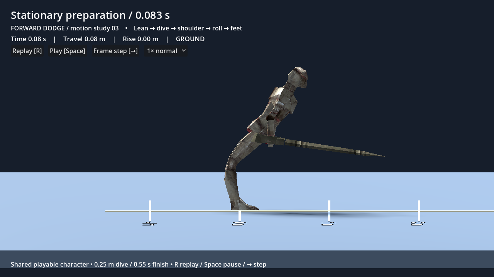
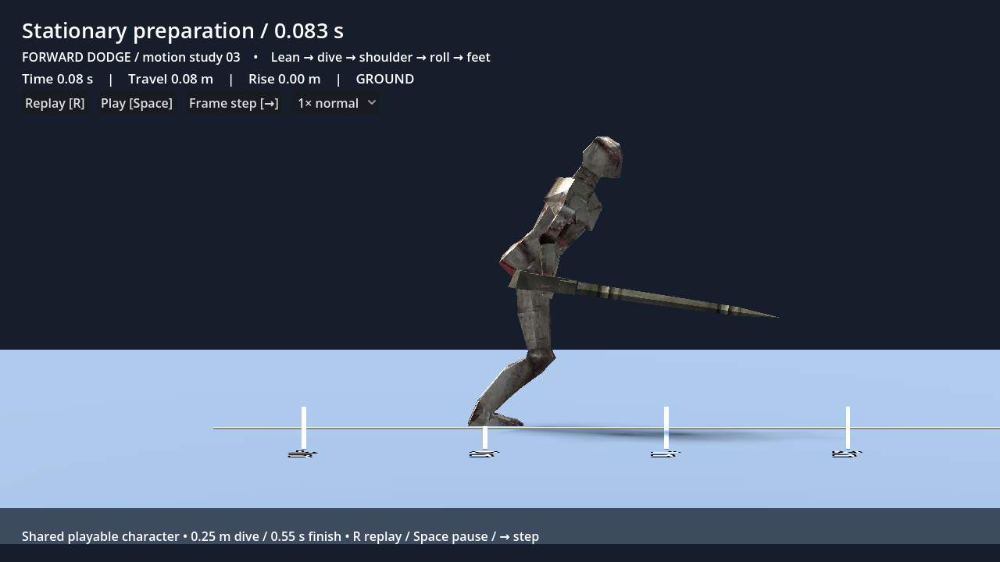

# Forward dive — adaptive clearance and raised gaps

Implemented for review on 20 September 2026, Godot **4.6.2.stable.official.71f334935**.

## Confirmed behavior

The user chose **adaptive clearance near obstacles**, preserving the shallow
open-ground dive. The requested example is a 0.60 m starting platform, a 0.5–0.6 m
gap and a 1.00 m destination: a **relative rise of 0.40 m**.

Both gap widths now pass at 30/60/120 Hz, starting 0.05, 0.35, 0.8 and 1.4 m back
from the edge. The dive also crosses 0.60 m obstacles from tested approach distances
of 0.4, 0.8, 1.5 and 2.4 m. The physical capsule moves through ordinary collision;
this is not a mesh-only lift or a teleport onto the destination.


[Normal-speed crossing](dive-clearance/raised-gap-normal.gif) ·
[Six-frame sequence](dive-clearance/raised-gap-sequence.png) ·
[Native frame measurements](dive-clearance/raised-gap-measurements.json)

## Preparation correction

Both knees previously changed from forward to backward about 0.04 s into the lean.
The dive now supplies an explicit forward knee direction to the two-bone leg solver,
while keeping its foot anchors. Ordinary locomotion retains pose-driven knee bending.
At an edge, unsupported preparation travel is withheld so the grounded lean cannot
walk the character off before takeoff. Losing actual floor support still cancels
preparation; this does not permit a midair launch.




These close views were captured on the actual Iris Xe. Updated full-motion flat
footage is in [DODGE_PREVIEW.md](../DODGE_PREVIEW.md).

## Implementation and ownership

| Owner | Responsibility |
| --- | --- |
| `features/character/character_motor.gd` | Read-only support probes, downward surface probes across gaps, capsule landing/headroom checks, and the sole physical launch/movement authority |
| `features/abilities/forward_dive.gd` | Select launch height once at grounded takeoff; own detected rise and launch height per action; preserve phase, budget, contact and interruption rules |
| `features/abilities/dodge_definition.gd` / `data/dodge_forward.tres` | Editable adaptive switch, maximum relative rise, margin, lookahead and probe spacing |
| `features/presentation/forward_dive_pose.gd` / `knight_locomotion.gd` | Forward knee constraint, planted preparation feet, launch blend and grounded roll; no collision-body displacement |
| `features/laboratory/dive_clearance_rig.tscn` | Reusable measured platforms shared by lab, physics tests and visual review |
| `scripts/dodge_preview.gd` / `scenes/dive_clearance_preview.tscn` | Stage and playback controls around the actual playable character |

At takeoff the motor scans three tracks within the character width. Downward rays
can find a raised destination beyond empty space. A raised capsule sweep limits
the scan at blocking walls. Only walkable surfaces within the relative rise limit
and with room for the standing capsule are candidates. Launch headroom is checked
before choosing the higher arc. Physical walls and ceilings remain authoritative
throughout the action, even if geometry changes after takeoff.

The action chooses `max(base_height, detected_rise + margin)`. It never changes
the shared Resource or replans the height in flight. Gravity and collision determine
actual motion; the rounded capsule can slide around a lip. Ground-roll playback
starts only on actual floor contact. Leaving a later edge pauses it without a
second launch. Reset, interruption, death and scene exit release action ownership.

## Tunable defaults and limits

| Setting | Value |
| --- | --- |
| Open-ground rise | 0.25 m |
| Maximum detected relative rise | 0.60 m |
| Clearance margin | 0.12 m |
| Lookahead from takeoff | 2.6 m |
| Surface-probe spacing | 0.10 m |
| Three scan tracks | Center and ±0.75 capsule radius |
| Preparation / extension | 0.10 / 0.05 s |
| Airborne forward speed | 11 m/s until actual floor contact |
| Grounded travel budget | 5.5 m shared/consumed across phases; exhaustion does not stop airborne travel |
| Grounded roll | 0.55 s |
| Stamina / immunity | 25 once; 0.06–0.32 s from takeoff |

The example's 0.40 m rise selects approximately 0.52 m launch height. A 0.60 m
obstacle selects approximately 0.72 m. Values differ slightly due to floor collision
margin. This is a local launch adaptation: a distant obstacle outside lookahead,
a taller wall, inadequate headroom or a landing beyond travel range is not a
guaranteed crossing. Probe spacing is tunable for unusually thin geometry.
Collision may shorten travel; blocked distance is consumed, never banked.
No jump, vault, auto-landing, posture change or additional immunity was introduced.
The old hop has subsequently been removed. Courtyard, Test Grounds and preview
share this forward dive and the referenced grounded side/back rolls.

## Play and inspect

1. Restart the game, enter **Character Test Grounds**, then choose
   **Esc → Go to station → 02 Jumping**.
2. Find the two southeast lanes marked **DIVE: 0.60 m TO 1.00 m**. Walk onto the
   lower deck, face across its gold edge and use Dodge (default Space). One gap
   is 0.50 m, the other 0.60 m. Failed falls hit the recovery area and reset to
   the station entrance.
3. For a fixed side view, open `scenes/dive_clearance_preview.tscn` and press
   **F6**. R replays, Space pauses, Right steps one physics tick, and the menu
   offers quarter speed. `scenes/dodge_preview.tscn` remains the flat comparison.
4. F5 still launches the courtyard. Camera/keybinding preferences are preserved.

## Verified results

**828 checks across 18 suites pass, zero script/engine errors.**
[Machine-readable report](validation/adaptive-clearance.json).

- 81 focused clearance checks: both requested gaps at 30/60/120 Hz and four edge
  setbacks; 0.60 m obstacles at four distances; diagonal approaches; eight headings
  at a translated world origin; narrow barriers; taller walls; ceilings; a wall
  before a destination; obstacles behind the actor; lower/level landings; missed
  long gaps; two actors sharing definitions with separate launch plans; reset cleanup.
- Six added lab checks: ordinary walking reaches both start decks, both actual
  fixture crossings succeed, and both catch areas reset to the entrance.
- Existing preparation, preview, action interruption/buffering, death/retry,
  camera, input, combat, slopes, stepping, roll/gap and reset suites remain passing.

Native 60 Hz captures on **Intel Iris Xe / Compatibility / Mesa 25.0.7-2**:

| Scene | Ground contact | Completed action | Horizontal travel |
| --- | --- | --- | --- |
| Open flat ground | 0.3833 s | 0.9333 s | 5.5000 m |
| 0.60 m → 1.00 m across 0.60 m gap | 0.4167 s | 0.9667 s | 5.2413 m |

Times include preparation and discrete physics ticks. The raised-gap lip consumes
some requested motion before the character clears it. The full path remains solid
collision, not displacement to a target. Native frames were visually inspected;
subjective weight and timing remain for the user's in-game review. These captures
are not a sustained release-performance benchmark.

Run focused checks:

```sh
python3 tools/run_tests.py --suite run_dive_clearance --suite run_lab
```

Capture and export the review (Godot executable on PATH):

```sh
godot --fixed-fps 60 --path . --script tests/render_dodge_preview.gd -- --raised-gap
python3 tools/export_dive_clearance.py
```

The renderer writes native frames under `/tmp/dive-clearance-frames`. Pillow is
required only by the optional export tool. The game needs no new runtime dependency.

Later refinement: [cliff dives and the timed landing skill](CLIFF_DIVE_LANDING.md).
