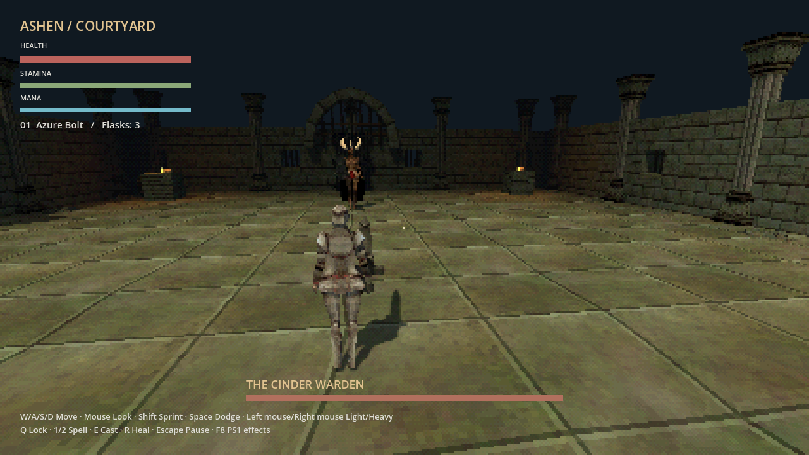
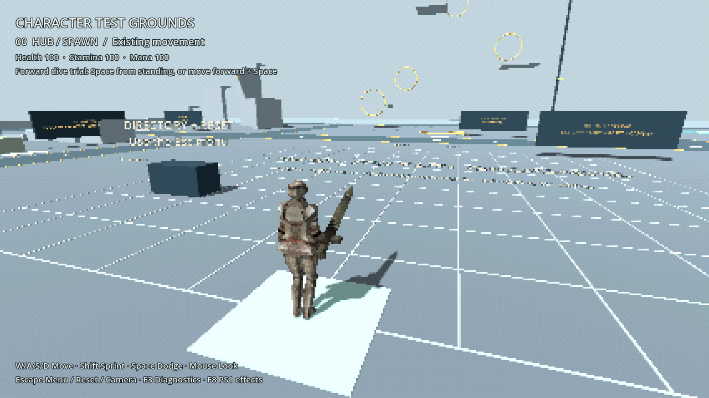
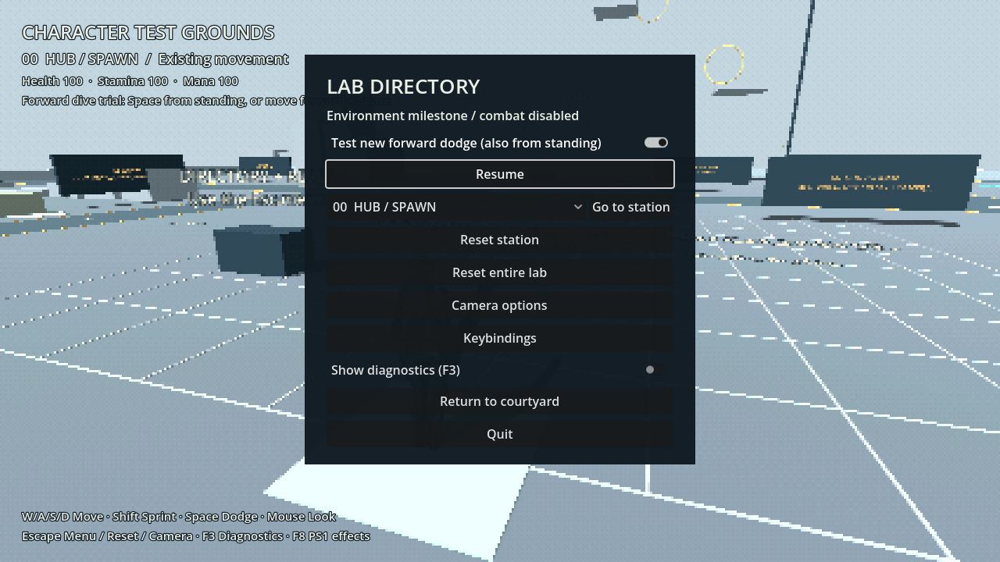
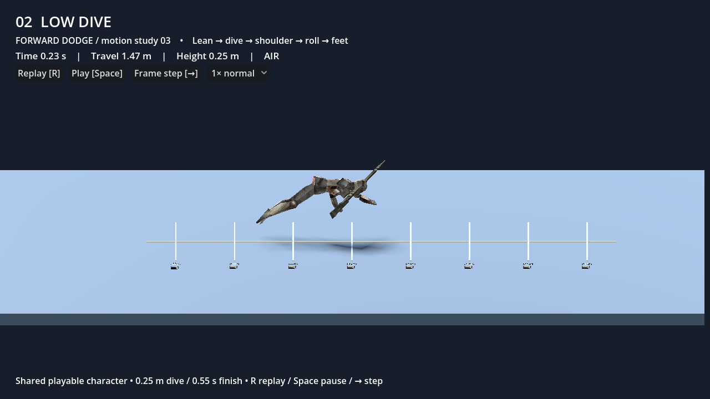

# Milestone 1 — playable review and validation

**20 September 2026 · Godot 4.6.2.stable.official.71f334935 · Compatibility**

This records the initial foundation migration. For the latest **869-check** result
and subsequent ownership fixes, see [Section 2 follow-up](SECTION2_REVIEW.md).
The scene screenshots below were refreshed after that follow-up; the original
baseline/migration test table remains historical evidence.

The courtyard, Test Grounds and motion preview now use one character implementation.
The existing combat, camera, keybindings, running, step-up and both dodge variants
are preserved. The work stops at this review boundary; no new movement mechanic,
procedural world, destruction or save system has been enabled.

## Review in Godot

1. **F5 / Run Project:** the courtyard. Try sword/spells, healing, camera lock,
   both shoulders, pause, death/victory and retry.
2. **Esc → Character Test Grounds**, or open `scenes/movement_lab.tscn` and **F6**.
   Try diagonal/S-turn running, full reversals, ramps and 0.60 m step-up.
   Compare the forward dive with the original dodge using the Esc menu toggle.
   Try station/all-lab reset and camera/keybinding options.
3. Open `scenes/dodge_preview.tscn` and **F6**. Replay, pause, frame-step and change
   speed. This is the same playable character, motor and ability—not a separate
   approximation. Stop here to review feel before another mechanic starts.

Restart an already running game after the code update.

## Actual GPU captures

Captured by `tests/render_foundation.gd` on **Mesa Intel Iris Xe (TGL GT2)**,
OpenGL 4.6 Compatibility, Mesa 25.0.7-2, 1280 × 720 viewport. Screenshots verify
scene rendering and UI, not sustained 60 FPS or release performance.

### Courtyard



### Test Grounds



### Laboratory menu



### Shared character preview



[Native normal-speed footage](dodge-preview-normal.gif) ·
[Quarter-speed footage](dodge-preview-slow.gif) ·
[Pose sequence](dodge-preview-poses.png)

At native 60 Hz, the forward dive lands at 0.3833 s, completes at 0.9333 s,
and travels 5.5000 m. The working-tree 0.10 s preparation and 0.05 s extension
settings were preserved. The old courtyard hop remains a separate configurable
variant. The 30/60/120 Hz suites validate actual contact, travel, clearance and
recovery; they do not claim subjective animation feel is approved.

## Automated evidence

**717 checks across 16 suites pass, with no script/engine errors.** Six additional
runner self-checks verify that failures, script errors, nonzero exits and missing
summaries cannot be reported as success.

| Suite | Checks | Result |
| --- | ---: | --- |
| `run` | 62 | Pass |
| `run_architecture` | 32 | Pass |
| `run_camera` | 33 | Pass |
| `run_dodge_lab` | 23 | Pass |
| `run_dodge_preview` | 37 | Pass |
| `run_keybindings` | 31 | Pass |
| `run_lab` | 66 | Pass |
| `run_lab_forward_dive` | 44 | Pass |
| `run_landing_roll` | 54 | Pass |
| `run_lock_movement` | 27 | Pass |
| `run_momentum` | 39 | Pass |
| `run_ramp_steps` | 110 | Pass |
| `run_roll_steps` | 78 | Pass |
| `run_rolls` | 28 | Pass |
| `run_running` | 26 | Pass |
| `run_steps` | 27 | Pass |

Run from the project directory:

```sh
python3 tools/run_tests.py
python3 tools/run_tests.py --suite run_architecture --suite run_camera
python3 tools/run_tests.py --self-test
```

Use `--godot` or `GODOT_BIN` to select another installed engine. On a fresh checkout,
first import the project in Godot. Each suite uses an isolated temporary user-data
folder, preserving personal camera/keybinding settings. Reports and raw logs go
to `.artifacts/tests/`. The runner checks output as well as process status because
Godot can return success despite script errors.

[Final machine-readable report](validation/milestone-1-final.json) ·
[Baseline report](validation/milestone-1-baseline.json) ·
[Iris Xe capture log](validation/iris-xe-capture.log) ·
[Per-frame dodge data](validation/forward-dive-frames.json)

## Baseline and migration notes

Before refactoring, 133 source/configuration/document files, Git status/diff and
a SHA256 manifest were saved to `/tmp/ashen-architecture-baseline-20260920/`.
Existing uncommitted changes were preserved; no commit, reset or push was performed.
The neighboring Python project was untouched.

The baseline ran **686 checks**. Fourteen suites passed; the preview suite had six
failures tied to old slow-timing pose expectations. It used its own collision
integrator and assumed 0.24/0.10 s preparation/extension, while the working tree
already contained 0.10/0.05 s. The replacement preview suite tests the actual actor:
37 checks replace its previous 38. Adding 32 architecture checks yields 717.
Old pose-speed bounds were not silently retuned and reported as passing; they are
retired with the duplicate simulation. Visual feel remains a review item.

The new architecture checks cover atomic combined costs, invalid costs, two-instance
isolation, capability/mode rejection, interruption policy, death/reset/unload,
multiple spell targets without an arena, bounded strike history, ongoing-cost order,
scripted input, projectile safety after caster unload and copied persistent records.
A cyclic preload discovered by engine-error checks was removed at the explicit
world-context boundary. Existing scene/script entry paths remain compatible.

## Remaining gates

- User review of running/dodge feel in the playable scenes.
- A real **release-build** performance benchmark with frame-time percentiles,
  memory, loading spikes and active body counts. Export templates are not installed
  yet; native editor-binary captures are not substituted for this benchmark.
- Additional mechanics and world systems proceed only in the approved milestone
  sequence. Flight/water/save/streaming/collapse acceptance tests become meaningful
  as those systems are implemented.

See [architecture](../ARCHITECTURE.md), [roadmap](../DEVELOPMENT_ROADMAP.md),
and [current context](../GAME_CONTEXT.md).
