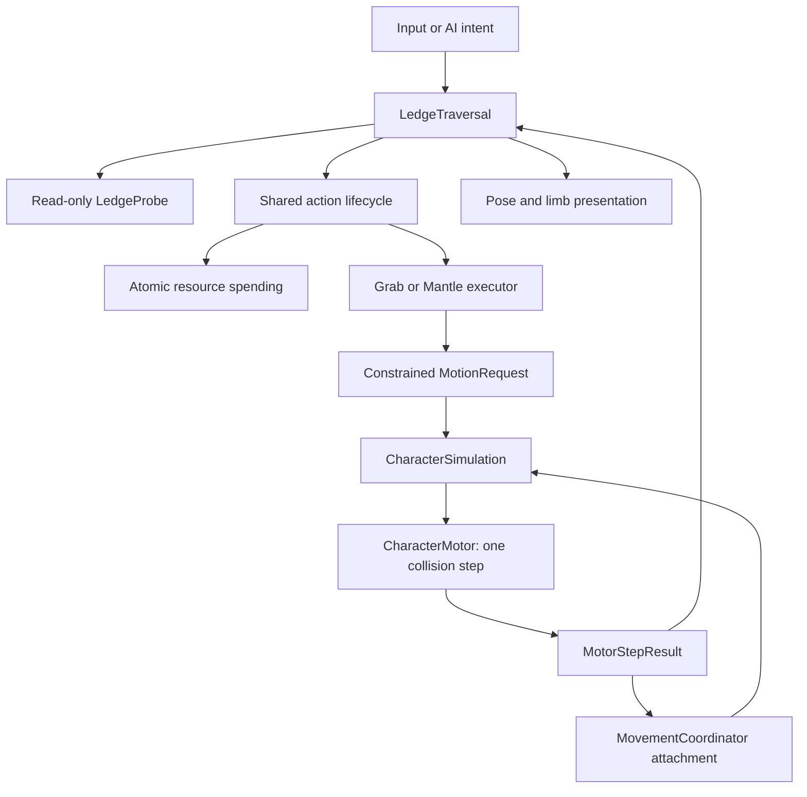

# Jump → ledge grab → hang → pull-up

**Implemented for review, 20 September 2026.** The user approved the control
recommendations and the two architecture changes: shared regeneration policy,
and motor-owned constrained movement with persistent surface attachment.
This is a bounded extension of jumping. Vertical free wall travel, wall jumps,
moving-platform traversal and flight remain future work.

## Sideways extension

[Sideways hanging and automatic safe corners](LEDGE_SHIMMY.md) are now implemented.
The attachment can submit locomotion requests, and only accepted motor results
commit new grips. Grab/hang/pull-up controls and costs below remain unchanged.

## Try it

From the courtyard choose **Esc → Character Test Grounds → Esc → Ledge tests**.
Alternatively run `scenes/movement_lab.tscn` with **F6**, then choose **Ledge tests**.
**F5** continues to launch the courtyard. The same character detects eligible
static geometry in either scene; the lab supplies fixtures and spawn placement.

The new course is in station **04 Climbing**. Its four lanes have a 1.5 m wall,
a 2.5 m reachable ledge, a low ceiling that permits hanging but prevents standing,
and an explicitly excluded wall. Tall free-climbing fixtures remain inactive.

- Jump toward a wall using the current Jump binding. The jump remains 1.2 m / 15 stamina.
- New grabs require the lip to be **above the default jump height measured from
  takeoff**. Lips at or below 1.2 m are skipped; higher lips still require valid
  reach, support and clearance. A 1 mm comparison tolerance handles roundoff.
  The rule reads the shared jump definition, so tuning jump height updates it.
- Release Forward to remain hanging. Hold **Forward** to pull up, independently
  of camera orbit. Holding Forward through the approach pulls up after the catch.
- Press the current **Dodge** binding to let go: ordinary falling, no dodge cost,
  roll, renewed jump allowance or invulnerability.
- Hanging never spends or regenerates stamina. Pull-up spends **10**, once, only
  after validating the route. Insufficient stamina keeps the safe hang.
- Pull-up may land on ground up to the existing **0.6 m step limit above or below
  the lip**. The probe searches up to 0.6 m farther inward for a supported standing
  footprint, lifts clear of the highest intervening surface, and settles at the
  actual destination height. Full-body sweeps and headroom checks still apply;
  missing floor, excessive height differences and blocked routes retain the hang.
- An accepted hit while attached enters ragdoll, including a hit at zero vertical
  speed. The laboratory's ordinary combat-disabled policy is preserved.
- **F3** shows the traversal status/rejection reason, hand anchors, proposed body
  path and landing footprint. **Reset station** clears the attachment and returns
  to the entrance; **Ledge tests** places the knight at the first lane again.

Fresh defaults use Space to jump and Alt to dodge. Existing saved/remapped
bindings remain intact; the on-screen guide uses those bindings.

Height-rule verification: **491 distinct checks across 11 targeted suites pass**.
The [focused report](validation/ledge-height-focused.json) covers height, probing,
pull-up and jump behavior; the [related report](validation/ledge-height-related.json)
covers approaches, lifecycle, poses, sideways/corner movement and integration.
Both include the 63-check height suite. Boundary checks run at 30/60/120 Hz,
including takeoff from elevated ground and a retuned jump definition.

The [uneven-landing regression report](validation/uneven-mantle-related.json)
passes **315 checks / 6 suites**, including real pull-ups onto ±0.25 m and ±0.6 m
destinations at 30/60/120 Hz, subsequent floor contact, costs, unsafe destinations,
and existing hanging, corner, lifecycle and pose behavior. Geometry/path selection
stays in `ledge_probe.gd`; the existing action executor and motor perform the move.


[Low ceiling, unpaid rejection and deliberate release](ledge-grab/ledge-blocked.gif)

## Files and ownership

```text
features/character/
  character_intent.gd              # World movement + camera-independent surface intent
  input_controller.gd              # Bindings → intent; manual/AI callers use same contract
  movement_coordinator.gd          # Mode, jump origin/eligibility, persistent attachment/token
  character_simulation.gd          # Selects ONE ordinary or constrained motor step
  motion_request.gd                # Adds CONSTRAINED target + attachment token
  motor_step_result.gd             # Actual displacement/velocity/support/obstruction
  character_motor.gd               # All body motion, collision sweeps and posture changes
  resource_regeneration_policy.gd  # Ground support + action/reaction eligibility
features/abilities/
  ability_controller.gd            # Registers Grab/Mantle; delegates execution
  action_lifecycle.gd              # Existing atomic costs, requests, finish/cancel
features/traversal/
  ledge_candidate.gd               # Per-query geometry snapshot + weak surface refs
  ledge_probe.gd                   # Read-only reach, hand support, path/standing checks
  surface_attachment.gd           # Per-character anchor lease, separate from an action
  ledge_traversal.gd               # Entry, brief grab, hang policy, release and cleanup
  mantle_action.gd                 # Lift → over → stand → actual floor contact
  mantle_definition.gd             # AbilityDefinition plus reach/posture/path settings
  mantle_pose.gd                   # Authored pose targets, separate from gameplay reach
  mantle_presentation.gd           # Bones, limb constraints, blending and sword stow
  data/ledge_grab.tres             # 0.24-second catch, no additional cost
  data/knight_mantle.tres           # 10 stamina; immutable shared definition
  data/pose_*.tres                 # Hang, lift, knee-over and stand poses
features/laboratory/
  ledge_test_rig.gd / .tscn         # Reusable course; no alternate character rules
  ledge_diagnostics.gd             # Read-only visualization of the current candidate
```

`player.gd` composes the feature. `CharacterPresentation` and `psx_knight.gd`
delegate its visuals. `ReactionController` explicitly recognizes attached hits.
The boss and player both use the shared regeneration policy; the Warden is not
silently given ledge abilities or the knight's poses.



Grab is short-lived; hanging is persistent movement support. Finishing Grab
releases the action slot without releasing the attachment. Pull-up acquires a
new action under the same attachment token. Completing, letting go, losing the
surface, damage, death, reset or unloading clears the appropriate ownership.
No feature writes the body's transform from animation or adds a traversal
physics loop. The shared simulation selects exactly one integration path.

Definitions are shared/read-only during play. Timers, candidates, weak references,
attachment serials, posture and pose captures belong to each character instance.
Future free climbing can use this attachment/motor contract and the validated
mantle exit; its entry/travel policies still need their own approved implementation.

## Geometry and the mathematical idea

Jump height and ledge reach are different measurements. With gravity 22 m/s²,

```text
v₀ = √(2gh) = √(2 × 22 × 1.2) ≈ 7.27 m/s
y(t) = y₀ + v₀t − ½gt²
```

The feet rise 1.2 m; the hands reach above them. A character-relative probe samples
forward for a near-vertical wall, then downward just inside it for an upward-facing
lip. Probe range includes this tick's horizontal travel. The candidate is bounded
by maximum root correction, a downward catch-speed limit and actual arm reach.
This is not a height-independent attraction to the nearest edge.

For normalized approach **d** and outward wall normal **n**, accept
`d · (−n) ≥ cos(50°)`. The top normal must be within 15° of up. Two separate hand
samples must agree on lip height and have supported solid geometry. The authored
hanging shoulders and arm lengths must satisfy, for each hand G and shoulder S:

```text
|L₁ − L₂| + ε ≤ |G − S| ≤ L₁ + L₂ − ε
```

Gameplay uses authored dimensions, not the current rendered bones. Visual
constraints use the same two-bone triangle relationship to rotate limbs without
stretching. Current knight lengths are approximately 0.292 m and 0.205 m. The hanging shoulder
height/offset and 0.07 m wrist clearance match the compact corner-safe pose.

With lip L, capsule radius r and outward normal n:

```text
hang root     = L + n × (r + 0.08) − up × 1.15
standing root = L − n × (r + 0.16) + up × 0.03
```

The candidate may permit hanging while rejecting pull-up. Pull-up additionally
checks five footprint samples, full standing headroom, and each compact-capsule
path segment. Modular wall and top colliders may form one lip. Static surface
transforms and support are revalidated; deletion, movement or invalidation releases
the attachment. `no_ledge_grab` group/metadata on a collider or ancestor excludes it.
Characters, rigid props and moving platforms are not accepted.

Each path phase requests an eased point:

```text
s(q) = 3q² − 2q³
requested_target = A + (B − A) × s(q)
```

The motor sweeps the full capsule toward that target in bounded segments. This
interpolation never grants permission to pass through collision. Acquisition
queries allow 3 mm of existing wall-contact tolerance; actual movement keeps the
full collision shape. The temporary capsule is 1.0 m high with its center 0.85 m
above the logical feet. Standing expansion is tested before use. If an interrupted
raised-foot tuck lands, the motor can restore standing upward from its actual
supported capsule bottom, avoiding a permanently buried logical foot origin.

The ground result comes from the sweep's contact normal, not a cached
`is_on_floor()` value: constrained `move_and_collide` does not refresh the normal
`move_and_slide` floor flags. Completion requires real top support. Missing support
or an unexpected obstacle aborts the motion rather than leaving the knight suspended.

## Timing, state and presentation

- Catch: **0.24 s**, smoothly moving into a compact supported hang.
- Pull-up: **0.40 s lift + 0.32 s across + 0.30 s stand**, then a bounded actual
  floor-contact settlement (maximum 0.30 s).
- Grip cooldown: 0.30 s; release also consumes jump-grab eligibility until a new jump.
- Maximum downward catch speed: 7.5 m/s. Only an ordinary eligible jump can auto-grab;
  a walk-off, deep fall, dodge, attack, cast, hurt or ragdoll cannot initiate it.
- No new invulnerability. Normal falling/impact rules resume after release.

The pose sequence catches with both hands, tucks the legs, lifts, brings a knee
across the lip and rises. Limb constraints hold the hands through lift, then release
them as the body crosses. The existing sword is temporarily stowed by presentation
and restored on exit/reset; no equipment system or new downloaded assets are added.

The shared regeneration policy requires grounded support and an available action
slot outside reactions/death. Cooldown time may elapse in the air, but missed
regeneration is never banked. Permitted actions still spend resources normally.
Flight's future exception is documented only; no flight behavior is implemented.

## Validation and review boundary

**2,140 checks across 37 suites pass** (167 additional checks over the baseline).
See [full results](validation/ledge-final.json) and the preserved
[pre-change baseline](validation/ledge-baseline.json). Focused suites cover:

- Geometry, reach limits, hand width, rotated approaches, separate wall/top bodies,
  low ceilings, thin tops, exclusions, stale candidates and removed/moved surfaces.
- 1.5 m and 2.5 m catches at 30/60/120 Hz; stationary/running/sprinting approaches
  and both ±40° diagonals; ordinary/excessively fast falls do not auto-catch.
- Free persistent hanging, atomic costs, insufficient stamina, release, pause,
  camera-independent Forward input, two instances, hits/death, every pull-up phase
  reset, unload cleanup and actual laboratory menu/fixture integration.
- Hand contacts through lift and skinned armor penetration at 30/60/120 Hz, with
  a 3.5 cm contact tolerance on the reference wall. The collision capsule remains solid.
- Standing restoration after an interrupted tuck, plus prior combat, camera,
  dodge, input, jumping, ragdoll, reset and resource regressions.

Native clips use Godot 4.6.2 Compatibility on the Iris Xe and the real shared
character. They are visual evidence, not a performance benchmark or a substitute
for the user's hands-on review. Borderline irregular ruins and long gameplay
sessions still benefit from manual testing. Review this mechanic before adding
free climbing, crouching, swimming, flight or another movement feature.

To rerun checks from the project directory:

```sh
python3 tools/run_tests.py --report docs/validation/ledge-final.json
```

To recreate captures, run `tests/render_ledge.gd` with a native Godot window and
`--fixed-fps 60`; add `-- --blocked` for the low-ceiling case. Then run
`python3 tools/export_ledge.py` (or add `--blocked`). Captures use isolated user-data
folders during development so saved player preferences are preserved.
