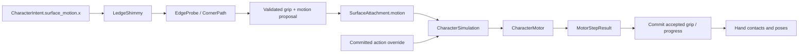

# Hanging sideways movement and corners

Implemented for review. The user selected automatic turns around safe inside and
outside corners. This extends ledge hanging; it does not implement vertical free
wall climbing or gap jumps.

## Controls and testing

Open **Character Test Grounds → Esc → Corner tests**, in station 04. Jump toward
the low wall and release Forward to hang. **Left/Right** (A/D on fresh defaults)
move along the edge, relative to the knight's current ledge face. Camera orbit
does not reverse these controls. Holding the same direction rounds a safe corner.

Release Left/Right to stop, including halfway around a corner. Opposite input
reverses the turn. Forward still requests pull-up wherever the route validates;
a blocked pull-up keeps the existing hold. Dodge still releases into an ordinary
fall. Saved bindings are used. No new stamina drain or regeneration is added.

The course includes an outside corner, an inside L corner, and an excluded segment.
Existing ledge tests and courtyard geometry use the same character. Gaps, height
breaks, unsupported hands and insufficient body clearance stop sideways movement
at the last supported hold. Losing actual support or an accepted hit uses the
existing fall/ragdoll rules. Resetting the lab clears the route and attachment.


## Code and ownership

| File | Responsibility |
| --- | --- |
| `features/traversal/ledge_shimmy.gd` | Lateral speed, route progress, pending proposal and accepted result |
| `features/traversal/ledge_edge_probe.gd` | Read-only wall/top/support queries and route validation |
| `features/traversal/ledge_corner_path.gd` | Geometric corner description and sampled grip/body targets |
| `features/traversal/shimmy_definition.gd`, `data/knight_shimmy.tres` | Shared immutable movement/geometry tuning |
| `features/traversal/shimmy_presentation.gd`, `data/shimmy_pose.tres` | Alternating hand transfers and subtle body sway |
| `features/traversal/ledge_traversal.gd` | Existing grab/hang/pull-up/release composition |
| `features/traversal/surface_attachment.gd` | Owned surface motion request and post-motion notification |
| `features/character/character_simulation.gd` | Selects one attached movement or committed-action request |
| `features/character/character_motor.gd` | Existing collision sweep; only body mover |
| `features/laboratory/ledge_corner_rig.gd`, `.tscn` | Reusable geometry and spawn markers |



Hanging remains movement support with a free action slot. Sideways locomotion is
not an indefinitely running ability. A committed action takes priority over the
attachment's locomotion request. Attachment tokens prevent stale motion from
controlling another grip, and completion reports actual movement before the
feature commits its next candidate. Body motion is still integrated once per tick.

The feature refers weakly to its coordinator to avoid a RefCounted ownership
cycle. Detach/reset/unload revoke the attachment's request, candidate and token.
Runtime speed, routes and hand transfers are per character; shared Resources hold
only definitions. No laboratory or boss parent assumptions enter the feature.

## How corners work

For outward wall normal **n**, ledge-relative right is **up × n**. On a straight
edge, a small signed displacement along that tangent proposes a new grip. Both
hands, lip height, wall eligibility and the compact capsule's sweep must validate.

Near a corner, rays discover the adjoining face. Its intersection with the current
face defines the corner pivot **C**, independent of node positions or box bounds.
The body normal rotates between the two face normals. Hand targets project from
the authored shoulders onto the reachable old or new edge. Each hand retains its
own face normal so wrists align with their actual supporting face during transfers.

At an outside corner, the body follows an outward rounded route around C. At an
inside corner, the route follows the intersection of the two offset face planes:

```text
offset intersection = C + r × (n₀ + n₁) / (1 + n₀ · n₁)
```

This keeps the capsule out of both walls instead of cutting diagonally through
the corner. The whole route is checked before starting; each requested step is
queried and swept again. Progress advances only after accepted motor movement.
A paused/reversed turn evaluates the same route at the corresponding progress.

A compact, forward-bent hanging pose replaces the wide knee spread that intersected
inside walls. Wrist height includes armor clearance. Presentation interpolates
one hand transfer at a time, retains the other grip, and adds a small sway based
on distance actually moved. None of these visual offsets move the collision body.

## Tuning and limits

- Straight speed: **0.75 m/s**, acceleration **3 m/s²**.
- Corner time: at least **1.0 s**, longer when required by path length/speed.
- Height continuity tolerance: **4.5 cm** per queried lip.
- Corner search: **0.65 m**, sampled route validation plus live collision sweeps.
- Candidate normal changes: **40–100°**; right-angle inside/outside corners are
  explicitly tested in both directions. Other shapes pass only if reach/support
  and collision validation succeed; rejected routes retain the hold.
- Static surfaces only, retaining the existing `no_ledge_grab` exclusions.

See the two focused definition Resources for editable values. Free climbing,
moving-surface attachment and jumping between disconnected handholds remain deferred.

## Validation

The full [regression report](validation/shimmy-final.json) passes **2,254 checks
across 40 suites**, including 114 new checks. It includes prior combat,
camera, input, movement, jumping, ledge, ragdoll and reset suites. New checks cover
both directions at 30/60/120 Hz; inside/outside corners; stopping/reversing; gaps,
exclusions, height breaks and obstructions; zero stamina; pull-up during a turn;
release, pause, hits, surface deletion, reset, unloading and multiple instances.
The pose suite measures skinned armor against both walls and verifies that the
corner actually completes; it also checks hand-target reach throughout the motion.

Native previews use the real shared knight/motor in Godot 4.6.2 Compatibility.
They are visual review evidence, not a performance benchmark. Test your preferred
speed and camera settings in-game before the next movement feature is started.

```sh
python3 tools/run_tests.py --report docs/validation/shimmy-final.json
```

For captures, run `tests/render_ledge.gd` natively with `--fixed-fps 60` and user
arguments `-- --shimmy` or `-- --shimmy --inside`, then run
`python3 tools/export_shimmy.py`. The preview has no alternate movement physics.
