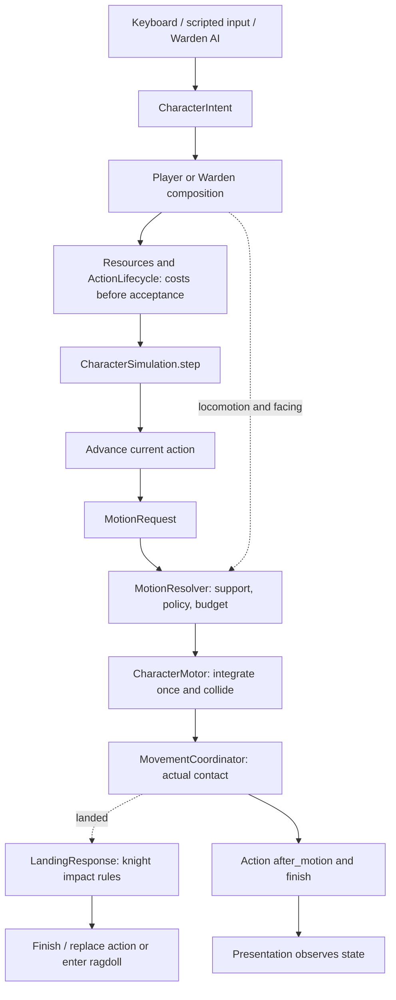

# Shared character motion: implementation walkthrough

Implemented 20 September 2026, Godot 4.6.2 stable, Compatibility renderer.
This change centralizes motion rules for the existing knight and Warden. It does
not add another movement mechanic or change the agreed dodge/landing design.

## The bug and the boundary that prevents it

The old player loop reset horizontal velocity each tick and expected every action
to supply its replacement. Forward diving and side/back rolling handled falling
separately. Fixing the forward executor left the side executor's finite ground
distance and timer able to stop it in the air. A shared motor could not help: it
correctly executed the zero-velocity requests it was given.

An action now supplies a **MotionRequest**. The shared **MotionResolver** decides
how that request combines with actual support and existing momentum. The motor
alone applies it to the body. An absent request means inherit air momentum;
intentional braking must be requested explicitly.

## Actual file structure

```text
features/
  character/
    character_intent.gd          # Controller input: direction, facing, action
    input_controller.gd          # Keyboard/scripted input
    warden_controller.gd         # Existing boss decisions
    player.gd                    # Knight composition and outer tick
    character_simulation.gd      # Shared action → motion → contact step
    motion_request.gd            # Typed transient motion command
    motion_resolver.gd           # Ground/air policy and per-character retention
    motion_budget.gd             # Per-action requested distance accounting
    character_motor.gd           # Sole character-body movement/collision owner
    movement_coordinator.gd      # Ground/air transitions and landed signal
    landing_response.gd          # Knight impact classification and skill check
    character_resources.gd       # Atomic costs, health, stamina, mana
  abilities/
    action_lifecycle.gd          # Queue, pay, own, finish/cancel; frame requests
    ability_definition.gd       # Shared read-only costs, modes and air policy
    ability_controller.gd       # Knight action execution
    ground_roll.gd               # Ground braking/playback clocks and poses
    forward_dive.gd              # Preparation, launch and roll phases
    warden_actions.gd            # Boss patterns submit the same requests
    data/
      dodge_ground.tres          # RETAIN_DEPARTURE
      dodge_forward.tres         # DIRECTED
      landing_roll.tres          # RETAIN_DEPARTURE
  reactions/                    # Physical ragdoll handover / recovery
  presentation/                 # Visual poses and camera; no body displacement
scripts/
  boss.gd                       # Warden composition and outer tick
tests/
  run_motion_contract.gd        # Shared rules through a minimal NPC fixture
  run_motion_boss.gd            # Production boss lunge/idle during a fall
  fixtures/motion_probe.gd      # No knight, camera, Combatant or world services
  fixtures/motion_probe_actions.gd
```

These are components composed by each character, not global singleton motion
state. Two characters can share a `.tres` and still have different velocities,
action requests, timers and remaining travel.

## One physics tick



1. The composition updates clocks/resources and samples the controller. Ongoing
   exertion is paid before new requests can reserve resources.
2. `CharacterSimulation.step()` captures control availability and starts a fresh
   frame request. Explicit facing is applied before directional attacks.
3. `actions.advance()` supplies a request when an ability needs movement. Neither
   the action nor its animation writes the body's horizontal velocity.
4. The resolver selects the ground/air rule and consumes requested distance.
5. The motor applies gravity, step handling and collision exactly once. It records
   the resulting air velocity for ordinary momentum inheritance.
6. The resolver captures departure velocity after collision, and the coordinator
   reports floor/mode changes. Contact listeners can cancel or replace an action.
7. `after_motion()` handles action phase/pose clocks. A contact-started replacement
   receives zero elapsed time for the predecessor's tick. Idle actions finish.

This is a shared **action/motion/contact step**, not a claim that every outer
character tick is identical. Input collection, resource policies, targeting and
presentation remain in their compositions. The Warden still has its original
ground handling and gravity integration setting. Knight fall damage, landing
skill checks and ragdoll are composed on the knight; attaching this simulation to
another NPC does not silently give it those gameplay rules.

## Motion policies

| Air policy | Meaning | Current use |
| --- | --- | --- |
| `INHERIT` | Keep the motor's collision-resolved momentum; allow configured weak air steering | Ordinary movement, jump, melee/cast recovery, Warden lunge |
| `RETAIN_DEPARTURE` | Capture the horizontal vector when support is lost and keep requesting it until contact/action release | Side/back rolls and timed landing roll |
| `DIRECTED` | Request the ability's explicit air vector each tick | Forward dive at its authored speed |

`MotionRequest.Kind.BRAKE` expresses deliberate deceleration. Omitting a request,
finishing an animation or releasing input does not imply air braking. On the
ground, ordinary locomotion still decelerates normally; commitment without motion
still holds position.

Collision always wins over a request. A retained or directed action can keep
pressing against a wall at its prescribed speed, but cannot move through it.
When the action releases, ordinary falling inherits the **actual post-collision
velocity**, not a remembered pre-wall speed. Losing the Warden's target now yields
idle input and cancels its action while continuing physics. Explicit encounter
freeze and death retain their existing stop behavior.

### Distance and clocks have different jobs

`MotionBudget` belongs to the live action, not the shared definition. Ground
requests are capped by its remaining distance. Air requests also consume it, but
are not stopped by exhaustion. Requested travel is consumed even against a wall,
so an obstruction cannot store extra distance for a later burst.

The side/back roll keeps its grounded braking and animation clocks paused while
unsupported. Its action-wide clock continues, so the immunity window still ends
at 0.32 seconds. Those clocks stay in the action executor; neither animation nor
its playback duration owns physical airborne momentum.

Ground roll remains 0.70 seconds / 4.34 m on level ground. Forward dive retains
its adaptive clearance and 5.5 m level-ground target. Cliff falls can exceed those
ground distances. Costs, landing-roll timing, damage and ragdoll policy remain as
documented in [CLIFF_DIVE_LANDING.md](CLIFF_DIVE_LANDING.md).

## Ownership and cleanup

- `ActionLifecycle` owns the current request and travel budget, resetting both on
  finish/cancel. Every tick starts with an inherit request to avoid stale commands.
- `MotionResolver` owns only the temporary departure vector and its action owner.
  Action completion/cancellation and motor reset/handover clear that state.
- `CharacterMotor` owns actual velocity. Releasing an action leaves air momentum
  intact; teleport/reset deliberately clears it. A pending launch invalidates
  cached floor contact before the next physics step.
- Connections between RefCounted owners use named methods. An initial captured
  lambda created a reference cycle; teardown tests now check its absence.

Direct motor launch and read-only clearance probes remain explicit ability calls.
This refactor centralizes horizontal arbitration; it does not invent swimming,
flight, root motion, or a general vertical-force system ahead of their design.

## Adding another ability or character

1. Agree on controls, supported modes, interruption/landing behavior, clocks and
   animation references before implementing the mechanic.
2. Put tunable values and its air policy in an `AbilityDefinition`. Keep runtime
   state out of shared Resources.
3. Implement action phases through the lifecycle hooks. Submit `request_motion()`;
   use the shared budget if ground travel is limited. Do not add another
   `request_horizontal()`, `move_and_slide()` or horizontal reset in an executor.
4. For another character, configure its motor, coordinator and lifecycle in
   `CharacterSimulation`; produce the same intent/request contracts from its AI.
   Choose its ground handling and landing/reaction components explicitly.
5. Test ledge departure during windup, active movement and recovery, ending or
   interrupting the action in midair, walls, real contact, repeated reset/unload
   and two instances sharing definitions. Run at 30/60/120 Hz.

The runner includes a source-boundary check to catch direct motion calls outside
the shared simulation/motor. Behavioral tests remain necessary: a source check
cannot prove that a new mechanic chose the right policy.

## Validation and review

Before this refactor: **1,812 checks / 28 suites** in
[motion-contract-baseline.json](validation/motion-contract-baseline.json).
After the refactor: **1,881 checks / 30 suites**, zero failed checks or engine
errors, in [motion-contract-final.json](validation/motion-contract-final.json).
The added suites contain 48 shared-contract checks and 21 production-Warden checks.
The new contract suite uses a minimal character, then a separate suite exercises
the real Warden. Existing combat, camera, input, ramps/steps, dodge, jumping,
landing, ragdoll and reset suites remain in the runner.

Native Godot captures on Iris Xe show all three directional rolls keeping
approximately **7.294 m/s** through an 8 m fall, including after 1.0 seconds.
See [right-roll playback](motion-contract/right-roll-falling.gif) and
[all three captures' measurements](motion-contract/render-measurements.json).
This is functional/visual verification, not a release performance benchmark.

Run all checks from the project directory:

```sh
python3 tools/run_tests.py --report docs/validation/motion-contract-final.json
```

In Godot, **F5** still launches the courtyard. Open
`scenes/movement_lab.tscn` and press **F6** for the Test Grounds; use its existing
drop test controls and F3 diagnostics to review the actual character.
