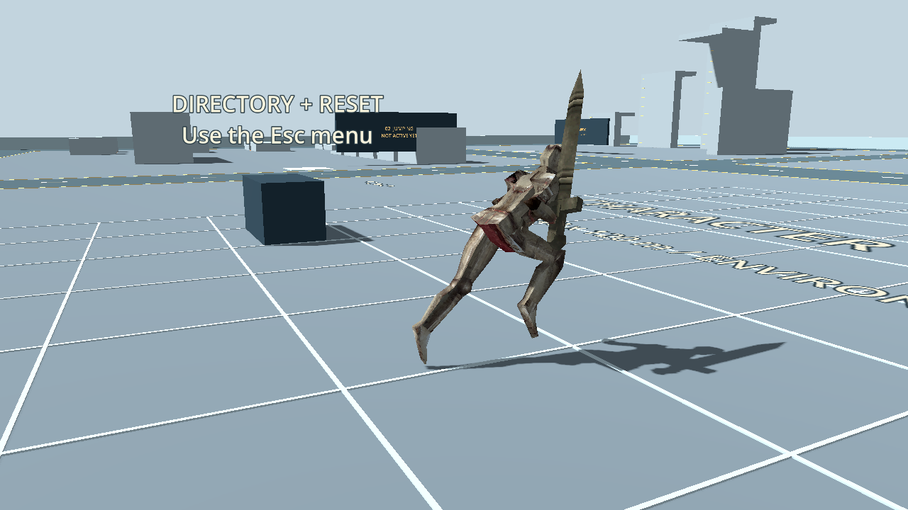
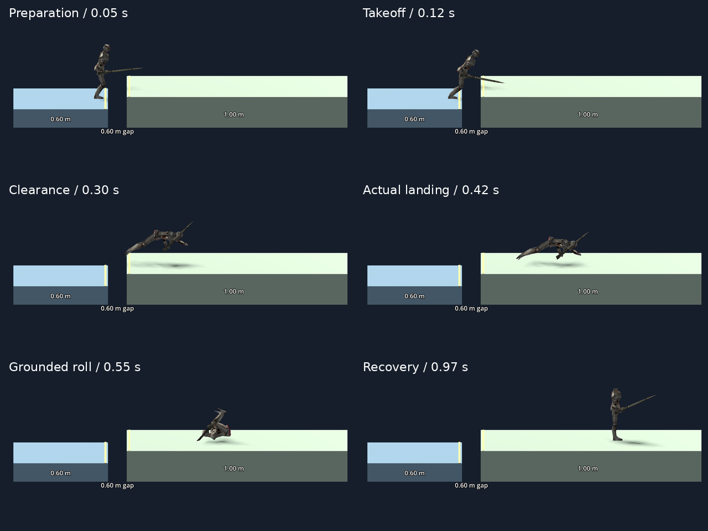
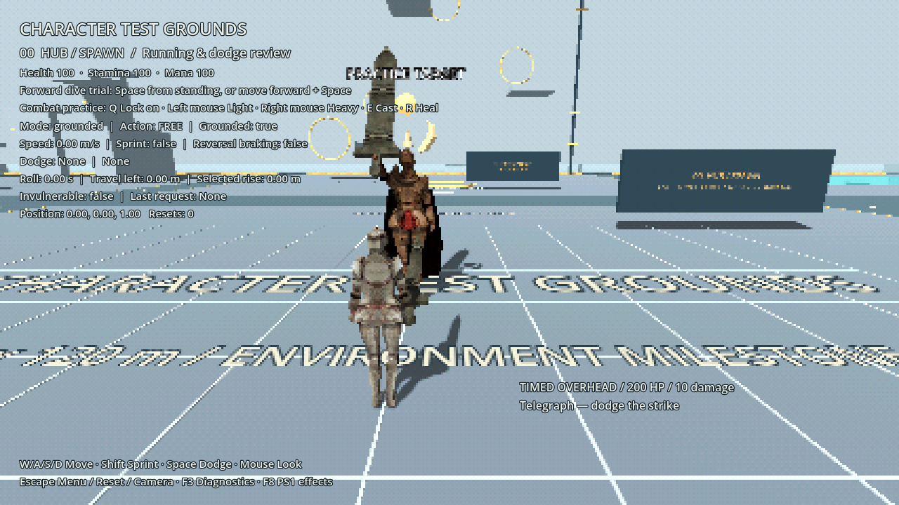
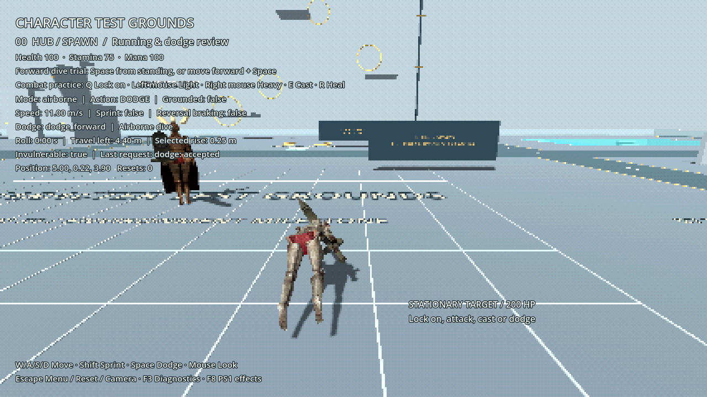

# Milestone 2.1 — running and dodge consolidation

**Started 20 September 2026.** First movement review gate. Jumping begins only
after this step is reviewed. The current movement settings are the baseline.

## Controls and references

Retain saved bindings: WASD moves relative to the camera, Shift requests sprint,
Space dodges, Q locks onto an available combat target, Esc opens the menu,
F3 shows diagnostics and F4 toggles PS1 effects. No new mandatory key binding.

Animation references remain the existing jog/sprint clips, speed-based lean,
15% S-turn lean boost and slope foot placement. The adaptive forward dive uses
the reviewed planted-foot lean, forward-bending knees, extension and grounded
Quaternius roll. Side/back directions use the supplied directional references
with no physical hop and user-selected 0.70 s playback. See
[implementation and native review](GROUND_ROLLS.md).




The user selected the adaptive forward dive with grounded side/back rolls, then
requested removal of the old hop. Courtyard, Test Grounds and preview now share
that selection through the common character. The comparison switch is removed.
No source animation downloads are needed. **Ask before further development.**

## Transition rules

- Ground movement accelerates toward 4.0 m/s or 6.5 m/s sprint. Released input
  brakes smoothly. Only a full reversal triggers special turn braking.
- Input length must not multiply dodge distance; ground/dodge direction is a
  finite, normalized horizontal vector regardless of controller source.
- Dodge starts from supported ground, pays once and commits through recovery.
  Direction and ability variant are fixed at acceptance. The existing short
  single-request buffer remains available near the end of recovery.
- Forward dive: preparation → airborne extension → actual landing → grounded roll.
  Side/back: immediate grounded clip → recovery, with no upward launch.
- Ground roll pauses on support loss. Landing never grants another launch or
  immunity window. Walls consume the requested travel budget.
- Damage outside immunity interrupts; death/reset/unload release action and pose
  ownership. Pause freezes both movement and action clocks.

## Acceptance criteria

| Area | Required result |
| --- | --- |
| Running | Existing acceleration/stopping, diagonal/S-turn speed, full-reversal braking and independent lock-on body rotation stay passing |
| Controller consistency | Scaled or vertically contaminated movement requests cannot increase horizontal speed/reach or steer physical dodge gravity |
| Clearance | Walking handles 0.60 m steps/ramp sides; adaptive dive clears the tested 0.60 m obstacles and 0.60 → 1.00 m platforms across 0.5/0.6 m gaps |
| Timing | The forward dive retains 0.55 s grounded finish and takeoff-based immunity; side/back use 0.70 s grounded playback and 0.06–0.32 s immunity from action start |
| Animation | Reuse reviewed poses; no airborne somersault, backward-bending preparation knees or collision-body movement by animation |
| Interruptions | Practice damage can cancel vulnerable actions; immunity rejects hits; death and repeated reset restore resources, camera and ownership |
| Review | Optional stationary/timed combat target and diagnostics are available without affecting ordinary lab use |
| Rates | Existing movement/dodge checks and new controller-consistency checks run at 30/60/120 Hz |

## Review route

1. Test Grounds → Esc → Movement practice → Running course. Try sprint, released
   stopping, diagonals, S-turns, full reversal, ramps and step blocks.
2. Choose Dodge gaps for the existing gap and raised-platform lanes.
3. Start hub practice with a stationary target for lock-on and combat transitions,
   or timed attacks for readable dodge-immunity/interruption tests.
4. Check the shared dodge in courtyard and lab. Use F3 for movement state, actual speed, phase,
   remaining travel and action request results. Reset station between attempts.

The optional target uses the existing Warden model and shared combat/action
systems. This is a movement test fixture, not a new boss or boss-content framework.
Its timed overhead deals 10 damage; reset restores it. Player death resets the
current practice attempt. Leaving the hub disables combat and removes the target.

## Implemented first pass

The controller-consistency regression reproduced excessive travel before the fix:
an input of `(0, 0, -3)` caused a 13.02 m original hop or 16.50 m forward dive.
Both now use the motor's finite horizontal direction boundary, retaining their
4.34 m / 5.50 m budgets regardless of input magnitude. Keyboard handling and
authored timing/animation settings are unchanged.

The new Movement practice menu provides the route shortcuts and optional hub
target. Timed attacks use the existing action lifecycle, telegraphs and strike
deduplication. The target profile is authored separately under
`features/laboratory/data/`; no shared courtyard definition is edited at runtime.
Leaving the hub removes combat and transients while allowing an active traversal
dodge to finish. Reset entire lab returns to the default combat-free hub.

`movement_review.gd` only observes real character state and request results. It
does not calculate a second movement timeline. F3 displays actual horizontal
speed, movement/action state, sprint/reversal state, dodge phase, grounded roll
time, remaining requested travel, selected rise and immunity.

## Latest directional-roll refinement

The selected side/back references now play immediately on the floor. A focused
ability executor owns timing and requests movement through the shared motor.
Flat-ground reach remains 4.34 m; steps retain existing 0.60 m capsule checks.
New checks confirm 0.70 s playback and no physical hop at 30/60/120 Hz.
Full regression now passes **1,347 checks across 22 suites**.
See [native preview and detailed results](GROUND_ROLLS.md).

## Initial consolidation validation and review evidence

The baseline was **869 checks across 19 suites**. The completed pass has
**947 checks across 21 suites**, with no engine/script errors. New suites cover
21 controller-consistency checks and 57 practice/integration checks. The existing
camera, combat, keybindings, movement, dodge, gap and animation suites still pass.

New practice checks include real damage during every vulnerable dive phase at
30/60/120 Hz, immunity, pause, death, target defeat, repeated resets, pending input,
projectile cleanup, shared-definition isolation and a dive across the hub boundary.
Subjective movement feel remains the user's review gate before jumping begins.

Native captures were rendered and inspected on Iris Xe with Godot 4.6.2
Compatibility. Menu panels fit the 1280 × 720 viewport; practice status remains
readable UI even with PS1 effects enabled. This is not a release performance test.





[Validation report](validation/movement-01-final.json) ·
[Baseline report](validation/movement-01-baseline.json) ·
[Native capture log](validation/movement-01-iris-xe.log)

```sh
python3 tools/run_tests.py
python3 tools/run_tests.py --suite run_movement_input --suite run_movement_practice
```
